Time series (BioTIME)
================

``` r
here::i_am(paste0(params$name, ".Rmd"), uuid = "964cf30c-e7ec-4fee-a704-f01c350f8766")
```

The purpose of this document is to analyse different time series from
the BioTIME database that could be interesting for the further process.

## Packages

``` r
library("conflicted")
library(dplyr)
library(data.table)
library(ggplot2)
library(viridis) # for color palettes
```

    ## Lade nötiges Paket: viridisLite

``` r
library(RColorBrewer)
library(phyloseq)
library(microViz)
```

    ## microViz version 0.10.10 - Copyright (C) 2023 David Barnett
    ## ! Website: https://david-barnett.github.io/microViz
    ## ✔ Useful?  For citation details, run: `citation("microViz")`
    ## ✖ Silence? `suppressPackageStartupMessages(library(microViz))`

``` r
# create or *empty* the target directory, used to write this file's data: 
projthis::proj_create_dir_target(params$name, clean = TRUE)

# function to get path to target directory: path_target("sample.csv")
path_target <- projthis::proj_path_target(params$name)

# function to get path to previous data: path_source("00-import", "sample.csv")
path_source <- projthis::proj_path_source(params$name)
```

## Read Data

``` r
#### read the file
dt_fullquery <- 
  fread("data/BioTIME/BioTIMEquery_24_06_2021.csv")
colnames(dt_fullquery)[1] <- "ID_SAMPLE"

#### read BioTIME Metadata
dt_biotimeMeta <-
  # fread("data/00-import-BioTIME-database/BioTIME_Meta_reduced.csv")
  fread("data/BioTIME/biotimeMetadata_24_06_2021.csv")
```

## Criteria to select a suitable study

- there should be enough DATA_POINTS (\>50)
- certain Abundance Type (“Count”) –\> not so important
- the samples should be taken from only one location
- the intervals between the time steps should be equal (e.g. one year)

``` r
# select possible IDs
possible_IDs <-
  # dt_biotimeMeta[DATA_POINTS > 35 & NUMBER_LAT_LONG == 1 & AB_BIO %in% c("AB", "A")]$STUDY_ID
  # c(339, 363, 414, 478, 39, 46, 413)
  c(339, 363, 478, 39)
```

``` r
# show available studies
dt_biotimeMeta[DATA_POINTS > 35 & NUMBER_LAT_LONG == 1 & AB_BIO %in% c("AB", "A")] %>%
  .[, YEARS := paste0(START_YEAR, "-", END_YEAR)] %>% 
  # .[, c("TITLE", "AB_BIO", "REALM", "CLIMATE", "START_YEAR", "END_YEAR") := NULL]%>% 
  .[, .(STUDY_ID, REALM, CLIMATE, TAXA, AB_BIO, DATA_POINTS, YEARS,
        NUMBER_OF_SPECIES, NUMBER_OF_SAMPLES, NUMBER_LAT_LONG, TOTAL, 
        ABUNDANCE_TYPE, BIOMASS_TYPE, TITLE)] %>% 
  .[order(-DATA_POINTS)] %>% 
  knitr::kable()
```

| STUDY_ID | REALM       | CLIMATE   | TAXA                     | AB_BIO | DATA_POINTS | YEARS     | NUMBER_OF_SPECIES | NUMBER_OF_SAMPLES | NUMBER_LAT_LONG | TOTAL | ABUNDANCE_TYPE | BIOMASS_TYPE | TITLE                                                                                                                                                 |
|---------:|:------------|:----------|:-------------------------|:-------|------------:|:----------|------------------:|------------------:|----------------:|------:|:---------------|:-------------|:------------------------------------------------------------------------------------------------------------------------------------------------------|
|      339 | Terrestrial | Temperate | Birds                    | A      |          57 | 1953-2009 |                39 |                57 |               1 |  1210 | Count          | NA           | Species trends turnover and composition of a woodland bird community in southern Sweden during a period of 57 years.                                  |
|      414 | Terrestrial | Temperate | Birds                    | A      |          48 | 1924-1976 |                48 |                48 |               1 |   963 | Density        | NA           | Bird populations in east central Illinois. Fluctuations variations and development over a half-century                                                |
|       46 | Terrestrial | Temperate | Birds                    | A      |          47 | 1928-1979 |                29 |                47 |               1 |   528 | Count          | NA           | Skokholm Bird Observatory                                                                                                                             |
|       39 | Terrestrial | Temperate | Birds                    | A      |          45 | 1970-2015 |                52 |                45 |               1 |   959 | Density        | NA           | Bird community dynamics in a temperate deciduous forest Long-term trends at Hubbard Brook                                                             |
|      413 | Terrestrial | Temperate | Birds                    | A      |          44 | 1927-1976 |                60 |               177 |               1 |  1196 | Density        | NA           | Bird populations in east central Illinois. Fluctuations variations and development over a half-century                                                |
|      363 | Terrestrial | Temperate | Birds                    | A      |          37 | 1963-1999 |                35 |                37 |               1 |   636 | Count          | NA           | The 37-year dynamics of a subalpine bird community with special emphasis on the influence of environmental temperature and Epirrita autumnata cycles. |
|      478 | Freshwater  | Temperate | Freshwater invertebrates | A      |          37 | 1969-2005 |                90 |                37 |               1 |  1537 | Count          | NA           | Long term study of the stream ecosystems in the Breitenbach                                                                                           |

## Function to extract one study

``` r
# function to extract one study out of the full query with adjusted Time column
extract_study <- function(data, ID) {
  
  tmp <- data[STUDY_ID == ID]
  
  # check if whole Times are given or only years
  if(tmp[!is.na(DAY) | !is.na(MONTH), .N] != 0) {
    tmp[, Time := as.Date(paste0(YEAR, "-", MONTH, "-", DAY), format = "%Y-%m-%d")]
  } else {
    tmp[, Time := YEAR]
  }
  
  tmp[, .(Time, Abundance = sum.allrawdata.ABUNDANCE, 
          Genus = GENUS, Species = GENUS_SPECIES)]
}
```

## Make phyloseq

``` r
# make phyloseq object for each study in list
for (study_id in possible_IDs) {
  # extract data of the specific study
  dt_study <-
    extract_study(dt_fullquery, ID = study_id)
  
  # create taxonomic table
  dt_tax_table <-
    dt_study[, .(Genus, Species)] %>%
    unique() %>%
    .[, TAX_ID := sprintf("sp-%03d", as.numeric(rownames(.)))]
  
  dt_study <-
    merge(dt_study, dt_tax_table,
          by = c("Genus", "Species"))
  
  dt_tax_table <-
    dt_tax_table %>%
    tibble::column_to_rownames("TAX_ID") %>%
    as.matrix()
  
  # extract sample information
  dt_sample_info <-
    dt_study[, .(Time)] %>%
    unique() %>%
    .[order(Time)] %>%
    .[, SampleID := sprintf("ID-%02d", as.numeric(rownames(.)))]
  
  dt_study <-
    merge(dt_study, dt_sample_info,
          by = c("Time"))
  
  dt_sample_info <- dt_sample_info %>%
    tibble::column_to_rownames("SampleID")
  
  # extract count table
  dt_count_table <-
    dt_study[, .(SampleID, TAX_ID, Abundance)]
  dt_otu_table <-
    dcast(dt_count_table, TAX_ID ~ SampleID, value.var = "Abundance") %>%
    tibble::column_to_rownames("TAX_ID")
  dt_otu_table[is.na(dt_otu_table)] <- 0
  
  # make phyloseq object and assign to ps_study_xy
  assign(paste0("ps_study_", study_id),
         phyloseq(
           otu_table(dt_otu_table, taxa_are_rows = T),
           tax_table(dt_tax_table),
           sample_data(dt_sample_info)
         ))
}
```

## Overview over phyloseq objects

``` r
ps_study_339
```

    ## phyloseq-class experiment-level object
    ## otu_table()   OTU Table:         [ 39 taxa and 57 samples ]
    ## sample_data() Sample Data:       [ 57 samples by 1 sample variables ]
    ## tax_table()   Taxonomy Table:    [ 39 taxa by 2 taxonomic ranks ]

``` r
ps_study_363
```

    ## phyloseq-class experiment-level object
    ## otu_table()   OTU Table:         [ 35 taxa and 37 samples ]
    ## sample_data() Sample Data:       [ 37 samples by 1 sample variables ]
    ## tax_table()   Taxonomy Table:    [ 35 taxa by 2 taxonomic ranks ]

``` r
# ps_study_414
ps_study_478
```

    ## phyloseq-class experiment-level object
    ## otu_table()   OTU Table:         [ 90 taxa and 37 samples ]
    ## sample_data() Sample Data:       [ 37 samples by 1 sample variables ]
    ## tax_table()   Taxonomy Table:    [ 90 taxa by 2 taxonomic ranks ]

``` r
ps_study_39
```

    ## phyloseq-class experiment-level object
    ## otu_table()   OTU Table:         [ 52 taxa and 45 samples ]
    ## sample_data() Sample Data:       [ 45 samples by 1 sample variables ]
    ## tax_table()   Taxonomy Table:    [ 52 taxa by 2 taxonomic ranks ]

``` r
# ps_study_46
# ps_study_413
```

## Available Species per time point

``` r
# for study 39
n_species_notZero <- psmelt(ps_study_478) %>% 
  as.data.table() %>% 
  .[, .(count = .N - sum(Abundance == 0)), by = Time]

n_species_notZero$count %>% min()
```

    ## [1] 34

``` r
n_species_notZero$count %>% max()
```

    ## [1] 50

``` r
n_species_notZero$count %>% mean()
```

    ## [1] 41.54054

``` r
# most frequently occuring species
occuring_freq <-
  psmelt(ps_study_478) %>% 
  as.data.table() %>% 
  .[, .(Abundance = sum(Abundance!= 0)), by = Species] %>% 
  .[order(-Abundance)]
(occuring_freq)
```

    ##                           Species Abundance
    ##  1:             Agapetus fuscipes        37
    ##  2:                 Leuctra nigra        37
    ##  3:                Baetis rhodani        37
    ##  4:         Protonemura intricata        37
    ##  5:              Leuctra digitata        37
    ##  6:        Amphinemura standfussi        37
    ##  7:              Nemoura cambrica        37
    ##  8:       Siphonoperla torrentium        37
    ##  9:          Chaetopteryx villosa        37
    ## 10:                 Leuctra prima        37
    ## 11:           Protonemura auberti        37
    ## 12:            Nemurella pictetii        37
    ## 13:        Sericostoma personatum        37
    ## 14:              Isoperla goertzi        37
    ## 15:       Plectrocnemia conspersa        37
    ## 16:              Drusus annulatus        37
    ## 17:                 Baetis vernus        36
    ## 18:              Tinodes rostocki        36
    ## 19:            Protonemura meyeri        36
    ## 20:            Apatania fimbriata        36
    ## 21:             Nemoura marginata        36
    ## 22:          Rhyacophila fasciata        36
    ## 23:                 Silo pallipes        36
    ## 24:       Potamophylax cingulatus        36
    ## 25:         Ephemerella mucronata        35
    ## 26:        Potamophylax luctuosus        34
    ## 27:         Wormaldia occipitalis        32
    ## 28:              Adicella reducta        32
    ## 29: Paraleptophlebia submarginata        31
    ## 30:            Ephemerella ignita        30
    ## 31:         Centroptilum luteolum        27
    ## 32:             Halesus digitatus        26
    ## 33:              Nemoura flexuosa        23
    ## 34:               Nemoura cinerea        22
    ## 35:         Limnephilus rhombicus        22
    ## 36:            Micrasema longulum        20
    ## 37:           Limnephilus sparsus        20
    ## 38:              Brachyptera risi        19
    ## 39:          Hydropsyche saxonica        19
    ## 40:                 Nemoura spec.        18
    ## 41:            Habrophlebia lauta        16
    ## 42:                  Baetis spec.        15
    ## 43:            Habrophlebia fusca        15
    ## 44:            Protonemura nitida        13
    ## 45:              Ecdyonurus spec.        13
    ## 46:                 Epeorus spec.        13
    ## 47:         Limnephilus centralis        13
    ## 48:        Hydropsyche instabilis        12
    ## 49:            Micropterna sequax        12
    ## 50:                  Lype reducta        10
    ## 51:         Stenophylax permistus         8
    ## 52:           Isoperla grammatica         7
    ## 53:         Odontocerum albicorne         6
    ## 54:        Brachyptera seticornis         6
    ## 55:           Limnephilus lunatus         6
    ## 56:      Potamophylax nigricornis         6
    ## 57:               Ephemera danica         5
    ## 58:        Limnephilus extricatus         5
    ## 59:               Leuctra inermis         4
    ## 60:          Hydropsyche siltalai         4
    ## 61:              Anabolia nervosa         4
    ## 62:             Hydropsyche spec.         4
    ## 63:           Cyrnus trimaculatus         4
    ## 64:              Halesus radiatus         3
    ## 65:         Micropterna lateralis         3
    ## 66:                 Leuctra fusca         3
    ## 67:                Beraea pullata         3
    ## 68:            Rhyacophila nubila         3
    ## 69:        Perlodes microcephalus         3
    ## 70:                Baetis muticus         2
    ## 71:            Halesus tesselatus         2
    ## 72:       Amphinemura sulcicollis         2
    ## 73:          Limnephilus auricula         2
    ## 74:       Ptilocolepus granulatus         2
    ## 75:       Hydropsyche pellucidula         2
    ## 76:      Glyphotaelius pellucidus         2
    ## 77:              Tinodes pallidus         1
    ## 78:        Sericostoma flavicorne         1
    ## 79:           Annitella obscurata         1
    ## 80:               Baetis fuscatus         1
    ## 81:           Limnephilus ignavus         1
    ## 82:         Athripsodes aterrimus         1
    ## 83:     Hydropsyche angustipennis         1
    ## 84:              Beraeodes eideli         1
    ## 85:             Drusus biguttatus         1
    ## 86:             Hydroptila sparsa         1
    ## 87:           Adicella filicornis         1
    ## 88:             Diplectrona felix         1
    ## 89:        Mystacides longicornis         1
    ## 90:                 Leuctra spec.         1
    ##                           Species Abundance

## Transform densities to relative abundances for study 39

``` r
# transform counts to relative abundance
ps_study_39_rel_counts <-
  transform_sample_counts(ps_study_39,
                          function(x) x / sum(x))
```

## Group dataset by Genus

Aggregate the timeseries by summarizing counts over Genus level.

``` r
for(study_id in possible_IDs) {
  tmp_ps <-
    get(paste0("ps_study_", study_id)) %>%
    # tax_fix(sep = "_") %>%
    # summarize over tax level, include NAs
    tax_glom(taxrank = "Genus", NArm = FALSE) %>%
    speedyseq::transmute_tax_table(Genus, .otu = Genus)
  
  assign(paste0("ps_study_", study_id, "_GenusLevel"),
         tmp_ps)
}
```

## Summarize over 10 most abundant Genera

### Get the 10 most abundant genera and 15 most abundant species

``` r
for(study_id in possible_IDs){
  ps_raw <- get(paste0("ps_study_", study_id))
  
  data <-
    ps_raw %>% 
    psmelt() %>%
    as_tibble()
  
  # get Genera with highest abundance (sum over all Counts for each Genus)
  most_abundant_genera <-
    data %>%
      group_by(Genus) %>%
      summarise(Sum_Abundance = sum(Abundance)) %>% # another possible criteria would be mean(Abundance)
      arrange(-Sum_Abundance) %>%
      .[1:10, "Genus"] %>% 
    as.vector()

  # Rename genera that are not in most_abundant_genera to "other"
  ps_tmp <- ps_raw %>%
    tax_mutate(Genus = if_else(
      Genus %in% most_abundant_genera$Genus,
      as.character(Genus),
      "other"
    ))
  
  # select only Genus and Species column of tax_table
  tax_table(ps_tmp) <- tax_table(ps_tmp)[, c("Genus", "Species")]
  
  ps_tmp <- ps_tmp %>%
    # summarize over tax level, include NAs
    tax_glom(taxrank = "Genus", NArm = FALSE) %>%
    speedyseq::transmute_tax_table(Genus, .otu = Genus)

  assign(paste0("ps_study_", study_id, "_Genus_10_most_abundant"),
         ps_tmp)
  
  #### 15 most abundant Species
   # get Species with highest abundance (sum over all Counts for each Species)
  most_abundant_species <-
    data %>%
      group_by(Species) %>%
      summarise(Sum_Abundance = sum(Abundance)) %>% # another possible criteria would be mean(Abundance)
      arrange(-Sum_Abundance) %>%
      .[1:15, "Species"] %>% 
    as.vector()

  # Rename species that are not in most_abundant_species to "other"
  ps_tmp <- ps_raw %>%
    tax_mutate(Species_grouped = if_else(
      Species %in% most_abundant_species$Species,
      as.character(Species),
      "other"
    )) %>%
    tax_mutate(Species = Species_grouped)
  
  # select only Genus and Species column of tax_table
  tax_table(ps_tmp) <- tax_table(ps_tmp)[, c("Species", "Species_grouped")]
  
  ps_tmp <- ps_tmp %>%
    # summarize over tax level, include NAs
    tax_glom(taxrank = "Species", NArm = FALSE)
  
  # select only Genus and Species column of tax_table
  tax_table(ps_tmp) <- tax_table(ps_tmp)[, c("Species")]

  assign(paste0("ps_study_", study_id, "_Species_15_most_abundant"),
         ps_tmp)
}
```

## Plot timeseries

``` r
for (study_id in possible_IDs) {
  plt_lines_Species <-
    ggplot(psmelt(get(paste0("ps_study_", study_id, "_Species_15_most_abundant"))),
           aes(x = Time, y = Abundance, col = Species)) +
    geom_line() +
    theme(legend.position = "none") +
      labs(title = paste0("Study ", study_id, " (by Species)"))
  
  plt_bar_Genus <-
    plot_bar(get(paste0("ps_study_", study_id)),
             x = "Time", fill = "Genus") +
    # theme(legend.position = "none") +
    geom_bar(aes(color = Genus, fill = Genus),
             stat = "identity",
             position = "stack") +
    labs(title = paste0("Study ", study_id, " (by Genus)"))
  
  plt_bar_Genus_ma <-
    plot_bar(get(paste0("ps_study_", study_id, "_Genus_10_most_abundant")),
             x = "Time", fill = "Genus") +
    # theme(legend.position = "none") +
    geom_bar(aes(color = Genus, fill = Genus),
             stat = "identity",
             position = "stack") +
    labs(title = paste0("Study ", study_id, " (only most abundant Genera)"))
  
  show(plt_lines_Species)
  show(plt_bar_Genus)
  show(plt_bar_Genus_ma)
}
```

<!-- --><!-- -->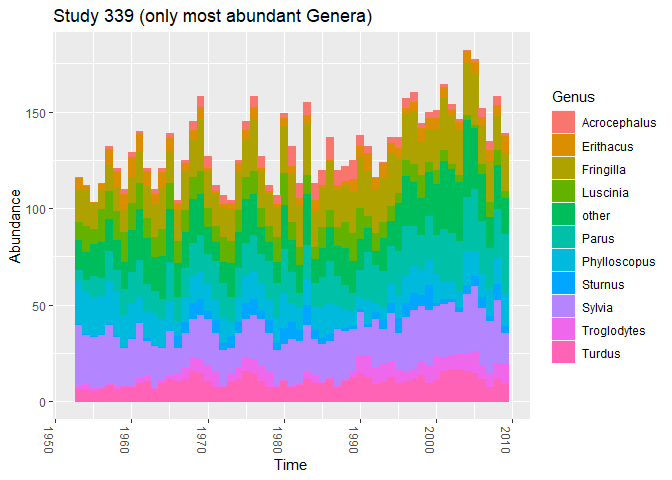<!-- -->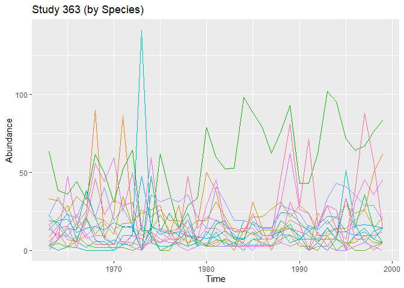<!-- -->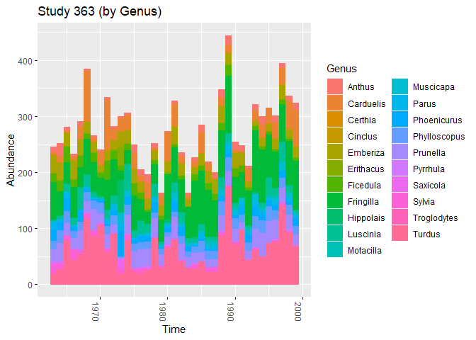<!-- --><!-- -->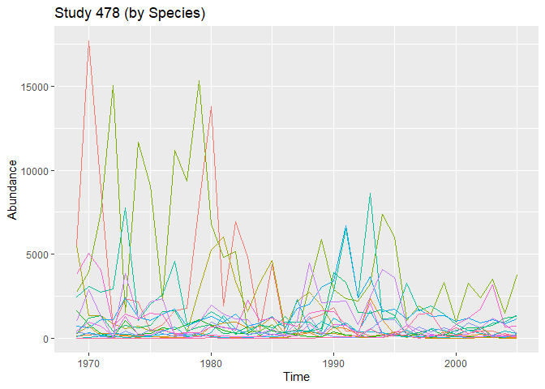<!-- --><!-- --><!-- --><!-- -->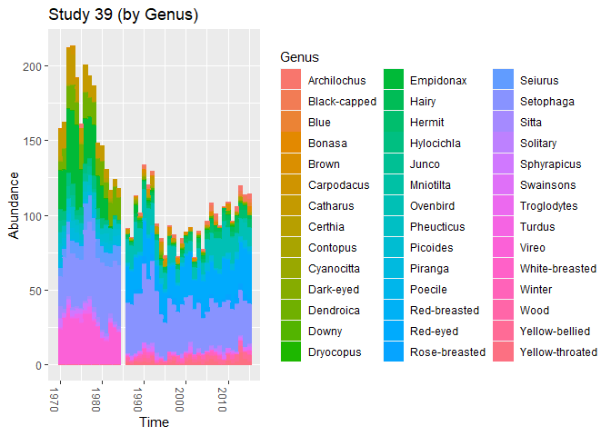<!-- --><!-- -->

## Save Phyloseq Objects

``` r
for (study_id in possible_IDs) {
  # ps on Species level
  saveRDS(get(paste0("ps_study_", study_id)),
          path_target(paste0("ps_study_", study_id, "_SpeciesLevel.rds")))
  # ps on Genus level
  saveRDS(get(paste0("ps_study_", study_id, "_GenusLevel")),
          path_target(paste0("ps_study_", study_id, "_GenusLevel.rds")))
  
  # save most abundant
  # ps on Species level
  saveRDS(get(paste0("ps_study_", study_id, "_Species_15_most_abundant")),
          path_target(paste0("ps_study_", study_id, "_Species_15_most_abundant.rds")))
  # ps on Genus level
  saveRDS(get(paste0("ps_study_", study_id, "_Genus_10_most_abundant")),
          path_target(paste0("ps_study_", study_id, "_Genus_10_most_abundant.rds")))
}

saveRDS(ps_study_39_rel_counts,
        path_target(paste0("ps_study_39_rel_counts.rds")))
```

## Save time series as csv files

``` r
for(study_id in possible_IDs) {
  
  # get the tmp phyloseq object
  ps_obj <- get(paste0("ps_study_", study_id, "_Species_15_most_abundant"))
  
  if(taxa_are_rows(ps_obj)) {
    otu_tmp <- t(otu_table(ps_obj))
  } else {
    otu_tmp <- otu_table(ps_obj)
  }
  # combine count data with time information
  ts_obj <-
    cbind(sample_data(ps_obj)[, "Time"],
          otu_tmp)
  # print(head(ts_obj))
  
  # save time series as csv file
  write.csv(
    ts_obj,
    path_target(paste0("ts_study_", study_id, "_Species_15_most_abundant.csv")),
    row.names = F
  )
    
}
for(study_id in possible_IDs) {
  
  # get the tmp phyloseq object
  ps_obj <- get(paste0("ps_study_", study_id, "_Genus_10_most_abundant"))
  
  if(taxa_are_rows(ps_obj)) {
    otu_tmp <- t(otu_table(ps_obj))
  } else {
    otu_tmp <- otu_table(ps_obj)
  }
  # combine count data with time information
  ts_obj <-
    cbind(sample_data(ps_obj)[, "Time"],
          otu_tmp)
  # print(head(ts_obj))
  
  # save time series as csv file
  write.csv(
    ts_obj,
    path_target(paste0("ts_study_", study_id, "_Genus_10_most_abundant.csv")),
    row.names = F
  )
    
}
```

<br>

## OLD SECTION: Data Preprocessing and Plotting

### Preprocessing steps of the sample data for each study:

1.  extracting the study ID from the whole dataset
2.  for Genus add Abundances at the same Date / same Genus
3.  calculating relative abundance by
    1)  Species
    2)  Genus (sum of abundance over the samples)
4.  Check how many Species/Genus have relative abundance below certain
    threshold -\> group them as “other”
5.  sum up abundances for group “other”

``` r
# create color vector for plotting
qual_col_pals = brewer.pal.info[brewer.pal.info$category == 'qual',]
col_vector = unlist(mapply(brewer.pal, qual_col_pals$maxcolors, rownames(qual_col_pals)))
```

### Function to preprocess data given a study ID and plot abundances afterwards

``` r
study_processing_bioTIME <-
  function(study_id, th_species = 0.05, th_genus = 0.05) {
    
    # Metadata (Information about this study)
    study_Meta <-
      dt_biotimeMeta[STUDY_ID == study_id] %>% 
      .[, METHODS := NULL]
    
    table_Meta <-
      data.table(Column = colnames(study_Meta),
                 Info = as.character(study_Meta[1,]))
    
    print(knitr::kable(table_Meta))
    cat("\n")
    
    
    # 1)  extract data of the specific study
    dt_study <-
      extract_study(dt_fullquery, ID = study_id)
    
    ## add zeros for missing values
    
    ### generate data.table with all combinations of Species/Genus and Time
    all_combinations <-
      as.data.table(tidyr::crossing(unique(dt_study$Time), unique(dt_study$Species)))
    colnames(all_combinations) <- c("Time", "Species")
    all_combinations[, Abundance := 0] %>% 
      .[, c("Genus", "tmp") := tstrsplit(Species, " ")] %>% 
      .[, tmp := NULL]
    
    ### merge combinations and zero values to dt_study
    dt_study <- 
      merge(dt_study, all_combinations,
            by = c("Time", "Species", "Genus"),
            all = T) %>% 
      .[, Abundance := Abundance.x] %>% 
      .[is.na(Abundance.x), Abundance := Abundance.y] %>% 
      .[, c("Abundance.x", "Abundance.y") := NULL]
    
    
    # 2)  summarize over multiple entries in the same year
    dt_study_genus <-
      dt_study[, .(Abundance_sum = sum(Abundance)),
        by = c("Time", "Genus")]
    
    
    # 3)  add relative abundance
    
    ## Species
    dt_study[, Abundance_rel := Abundance/ sum(Abundance), 
             by = c("Time")]
    
    ## Genus
    dt_study_genus[, Abundance_rel := Abundance_sum / sum(Abundance_sum), 
             by = c("Time")]
    
    
    # 3)  Group Species/Genus with relative abundance below a certain threshold as "other"
    
    ## add Species "other" for max. rel. abundance < threshold
    Species_other <-
      dt_study[, .(max_Abundance = max(Abundance_rel)),
             by = c("Species")] %>% 
      .[max_Abundance < th_species, .(Species)]
    
    dt_study_species <-
      dt_study[, Species_grouped := Species] %>% 
      .[Species %in% Species_other$Species, Species_grouped := "other"]
    
    ## add Genus "other" for max. rel. abundance < threshold
    Genus_other <-
      dt_study_genus[, .(max_Abundance = max(Abundance_rel)),
             by = c("Genus")] %>% 
      .[max_Abundance < th_genus, .(Genus)]
    
    dt_study_genus[, Genus_grouped := Genus] %>% 
      .[Genus %in% Genus_other$Genus, Genus_grouped := "other"]
    
    
    # 5)  sum up abundances for group "other"
    
    ## Species
    dt_study_species <-
      dt_study_species[, .(Abundance = sum(Abundance),
                           Abundance_rel = sum(Abundance_rel)),
        by = c("Time", "Species_grouped")]
    
    ## Genus
    dt_study_genus <-
      dt_study_genus[, .(Abundance_sum = sum(Abundance_sum),
                         Abundance_rel = sum(Abundance_rel)),
        by = c("Time", "Genus_grouped")]
    
    ### save timeseries
    ## Genus
    ts_study_genus <-
      dcast(dt_study_genus, Time ~ Genus_grouped, 
            value.var = "Abundance_sum")
    write.csv(ts_study_genus,
              path_target(paste0("ts_study_", study_id, "_Genus_grouped.csv")),
              row.names = F)
    ## Species
    ts_study_species <-
      dcast(dt_study_species, Time ~ Species_grouped, 
            value.var = "Abundance")
    write.csv(ts_study_species,
              path_target(paste0("ts_study_", study_id,
                                 "_Species_grouped.csv")),
              row.names = F)
    
    ### plot timeseries
    
    # if number of species/genus is too large, then do not plot legend
    # Species
    n_species <- uniqueN(dt_study_species$Species)
    if(n_species > 20){
      legend_species = "none"
    } else {
      legend_species = "right"
    }
    # Genus
    n_genus <- uniqueN(dt_study_genus$Genus)
    if(n_genus > 20){
      legend_genus = "none"
    } else {
      legend_genus = "right"
    }
    
    # by Species, total
    pl_species_total <-
      ggplot(dt_study_species, aes(Time, Abundance)) +
      geom_line(aes(col = Species_grouped))  +
      labs(title = "by Species, total Abundances",
           subtitle = paste0("Study ", study_id)) +
      theme(legend.position = legend_species) +
      scale_color_viridis(discrete = TRUE, option = "turbo")
      # scale_color_discrete(type = sample(col_vector, n_species))
    
    # by Species, relative
    pl_species_rel <-
      ggplot(dt_study_species, aes(Time, Abundance_rel)) +
      geom_bar(aes(fill = Species_grouped), stat = "identity") +
      labs(title = "by Species, relative Abundances",
           subtitle = paste0("Study ", study_id)) +
      theme(legend.position = legend_species) +
      scale_fill_viridis(discrete = TRUE, option = "turbo")
      # scale_fill_discrete(type = sample(col_vector, n_species))
    
    # by Genus, total (Abundance summed up)
    pl_genus_total <-
      ggplot(dt_study_genus, aes(Time, Abundance_sum)) +
      geom_line(aes(col = Genus_grouped))  +
      labs(title = "by Genus, total Abundances",
           subtitle = paste0("Study ", study_id)) +
      theme(legend.position = legend_genus) +
      scale_color_viridis(discrete = TRUE, option = "turbo") 
    
    # by Genus, relative (Abundance summed up)
    pl_genus_rel <-
      ggplot(dt_study_genus, aes(Time, Abundance_rel)) +
      geom_bar(aes(fill = Genus_grouped), stat = "identity")  +
      labs(title = "by Genus, relative Abundances",
           subtitle = paste0("Study ", study_id)) +
      theme(legend.position = legend_genus) +
      scale_fill_viridis(discrete = TRUE, option = "turbo") 
    
    print(pl_species_total)
    print(pl_species_rel)
    print(pl_genus_total)
    print(pl_genus_rel)
  }
```

## Examples

### (1) 339

``` r
study_processing_bioTIME(study_id = 339)
```

    ## 
    ## 
    ## |Column            |Info                                                                                                                                      |
    ## |:-----------------|:-----------------------------------------------------------------------------------------------------------------------------------------|
    ## |STUDY_ID          |339                                                                                                                                       |
    ## |REALM             |Terrestrial                                                                                                                               |
    ## |CLIMATE           |Temperate                                                                                                                                 |
    ## |GENERAL_TREAT     |NA                                                                                                                                        |
    ## |TREATMENT         |NA                                                                                                                                        |
    ## |TREAT_COMMENTS    |NA                                                                                                                                        |
    ## |TREAT_DATE        |NA                                                                                                                                        |
    ## |HABITAT           |Forest                                                                                                                                    |
    ## |PROTECTED_AREA    |FALSE                                                                                                                                     |
    ## |BIOME_MAP         |Temperate broadleaf and mixed forests                                                                                                     |
    ## |TAXA              |Birds                                                                                                                                     |
    ## |ORGANISMS         |birds                                                                                                                                     |
    ## |TITLE             |Species trends turnover and composition of a woodland bird community in southern Sweden during a period of 57 years.                      |
    ## |AB_BIO            |A                                                                                                                                         |
    ## |HAS_PLOT          |N                                                                                                                                         |
    ## |DATA_POINTS       |57                                                                                                                                        |
    ## |START_YEAR        |1953                                                                                                                                      |
    ## |END_YEAR          |2009                                                                                                                                      |
    ## |CENT_LAT          |55.71667                                                                                                                                  |
    ## |CENT_LONG         |13.33333                                                                                                                                  |
    ## |NUMBER_OF_SPECIES |39                                                                                                                                        |
    ## |NUMBER_OF_SAMPLES |57                                                                                                                                        |
    ## |NUMBER_LAT_LONG   |1                                                                                                                                         |
    ## |TOTAL             |1210                                                                                                                                      |
    ## |GRAIN_SIZE_TEXT   |                                                                                                                                          |
    ## |GRAIN_SQ_KM       |0                                                                                                                                         |
    ## |AREA_SQ_KM        |7.1e-06                                                                                                                                   |
    ## |CONTACT_1         |Soren Svensson                                                                                                                            |
    ## |CONTACT_2         |                                                                                                                                          |
    ## |CONT_1_MAIL       |soren.svensson@biol.lu.se                                                                                                                 |
    ## |CONT_2_MAIL       |                                                                                                                                          |
    ## |LICENSE           |CC-by                                                                                                                                     |
    ## |WEB_LINK          |http://springer                                                                                                                           |
    ## |DATA_SOURCE       |Ornis Svecica                                                                                                                             |
    ## |SUMMARY_METHODS   |grids                                                                                                                                     |
    ## |LINK_ID           |NA                                                                                                                                        |
    ## |COMMENTS          |FM set day to 1 and month to May for all (period 19th April to 18th June each year) also did zeroes for depth and biomass instead of NULL |
    ## |DATE_STUDY_ADDED  |Aug-16                                                                                                                                    |
    ## |ABUNDANCE_TYPE    |Count                                                                                                                                     |
    ## |BIOMASS_TYPE      |NA                                                                                                                                        |
    ## |SAMPLE_DESC_NAME  |lat_long_year                                                                                                                             |

<!-- --><!-- --><!-- -->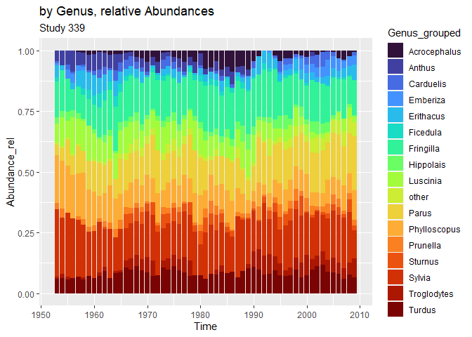<!-- -->

<br>

### (2) 478

``` r
study_processing_bioTIME(study_id = 478)
```

    ## 
    ## 
    ## |Column            |Info                                                        |
    ## |:-----------------|:-----------------------------------------------------------|
    ## |STUDY_ID          |478                                                         |
    ## |REALM             |Freshwater                                                  |
    ## |CLIMATE           |Temperate                                                   |
    ## |GENERAL_TREAT     |NA                                                          |
    ## |TREATMENT         |NA                                                          |
    ## |TREAT_COMMENTS    |NA                                                          |
    ## |TREAT_DATE        |NA                                                          |
    ## |HABITAT           |Central European streams                                    |
    ## |PROTECTED_AREA    |FALSE                                                       |
    ## |BIOME_MAP         |Small river ecosystems                                      |
    ## |TAXA              |Freshwater invertebrates                                    |
    ## |ORGANISMS         |insects                                                     |
    ## |TITLE             |Long term study of the stream ecosystems in the Breitenbach |
    ## |AB_BIO            |A                                                           |
    ## |HAS_PLOT          |Y                                                           |
    ## |DATA_POINTS       |37                                                          |
    ## |START_YEAR        |1969                                                        |
    ## |END_YEAR          |2005                                                        |
    ## |CENT_LAT          |50.669722                                                   |
    ## |CENT_LONG         |9.628889                                                    |
    ## |NUMBER_OF_SPECIES |90                                                          |
    ## |NUMBER_OF_SAMPLES |37                                                          |
    ## |NUMBER_LAT_LONG   |1                                                           |
    ## |TOTAL             |1537                                                        |
    ## |GRAIN_SIZE_TEXT   |NA                                                          |
    ## |GRAIN_SQ_KM       |0                                                           |
    ## |AREA_SQ_KM        |1                                                           |
    ## |CONTACT_1         |Diana Bowler                                                |
    ## |CONTACT_2         |NA                                                          |
    ## |CONT_1_MAIL       |diana.bowler@senckenberg.de                                 |
    ## |CONT_2_MAIL       |NA                                                          |
    ## |LICENSE           |CC-by                                                       |
    ## |WEB_LINK          |None                                                        |
    ## |DATA_SOURCE       |Contributed by author (supplemental to a book)              |
    ## |SUMMARY_METHODS   |Nets                                                        |
    ## |LINK_ID           |NA                                                          |
    ## |COMMENTS          |NA                                                          |
    ## |DATE_STUDY_ADDED  |Nov-16                                                      |
    ## |ABUNDANCE_TYPE    |Count                                                       |
    ## |BIOMASS_TYPE      |NA                                                          |
    ## |SAMPLE_DESC_NAME  |lat_long_year_plotID                                        |

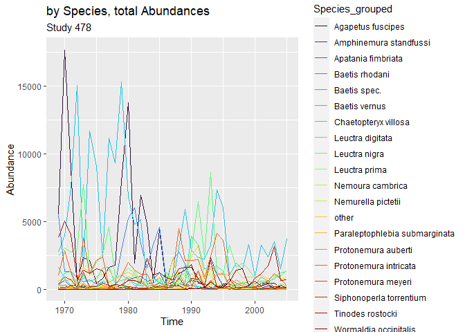<!-- -->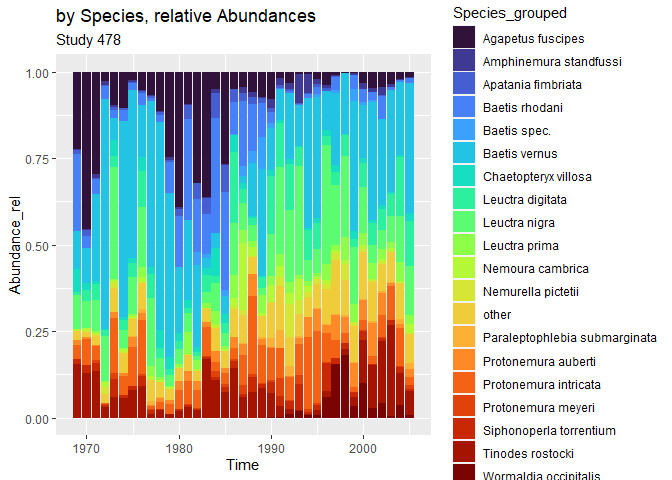<!-- -->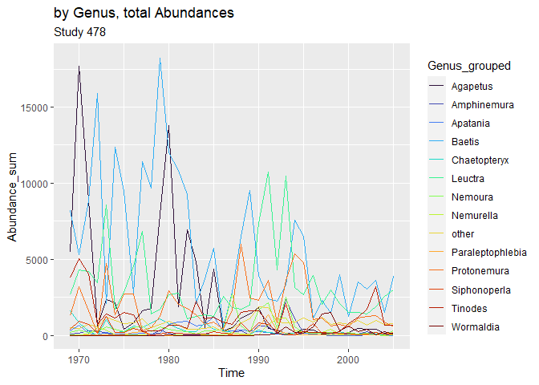<!-- -->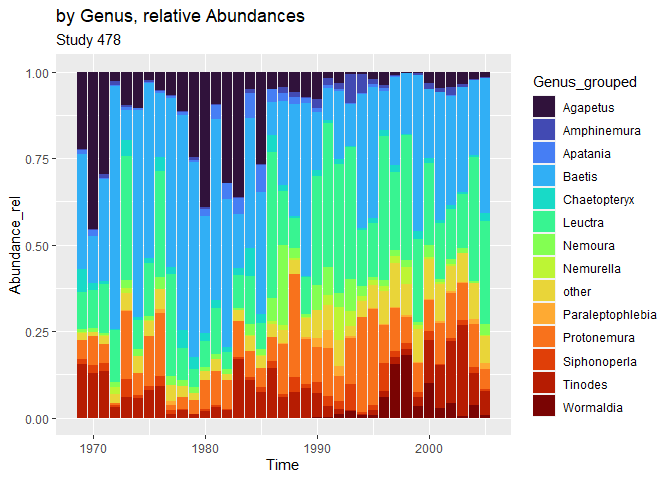<!-- -->

<br>

### (3) 363

``` r
study_processing_bioTIME(study_id = 363)
```

    ## 
    ## 
    ## |Column            |Info                                                                                                                                                  |
    ## |:-----------------|:-----------------------------------------------------------------------------------------------------------------------------------------------------|
    ## |STUDY_ID          |363                                                                                                                                                   |
    ## |REALM             |Terrestrial                                                                                                                                           |
    ## |CLIMATE           |Temperate                                                                                                                                             |
    ## |GENERAL_TREAT     |NA                                                                                                                                                    |
    ## |TREATMENT         |NA                                                                                                                                                    |
    ## |TREAT_COMMENTS    |NA                                                                                                                                                    |
    ## |TREAT_DATE        |NA                                                                                                                                                    |
    ## |HABITAT           |Forest                                                                                                                                                |
    ## |PROTECTED_AREA    |TRUE                                                                                                                                                  |
    ## |BIOME_MAP         |Tundra                                                                                                                                                |
    ## |TAXA              |Birds                                                                                                                                                 |
    ## |ORGANISMS         |birds                                                                                                                                                 |
    ## |TITLE             |The 37-year dynamics of a subalpine bird community with special emphasis on the influence of environmental temperature and Epirrita autumnata cycles. |
    ## |AB_BIO            |A                                                                                                                                                     |
    ## |HAS_PLOT          |Y                                                                                                                                                     |
    ## |DATA_POINTS       |37                                                                                                                                                    |
    ## |START_YEAR        |1963                                                                                                                                                  |
    ## |END_YEAR          |1999                                                                                                                                                  |
    ## |CENT_LAT          |65.968055                                                                                                                                             |
    ## |CENT_LONG         |16.31666                                                                                                                                              |
    ## |NUMBER_OF_SPECIES |35                                                                                                                                                    |
    ## |NUMBER_OF_SAMPLES |37                                                                                                                                                    |
    ## |NUMBER_LAT_LONG   |1                                                                                                                                                     |
    ## |TOTAL             |636                                                                                                                                                   |
    ## |GRAIN_SIZE_TEXT   |NA                                                                                                                                                    |
    ## |GRAIN_SQ_KM       |0                                                                                                                                                     |
    ## |AREA_SQ_KM        |9.8e-06                                                                                                                                               |
    ## |CONTACT_1         |Anders Enemar                                                                                                                                         |
    ## |CONTACT_2         |                                                                                                                                                      |
    ## |CONT_1_MAIL       |anders.enemar@gmail.com                                                                                                                               |
    ## |CONT_2_MAIL       |                                                                                                                                                      |
    ## |LICENSE           |ODbL                                                                                                                                                  |
    ## |WEB_LINK          |http://www.luvre.org/data_o_pdf/Luvre-130%202004%20Enemar%20mfl%2037%20ar%20skogen.pdf                                                                |
    ## |DATA_SOURCE       |Ornis Svecica                                                                                                                                         |
    ## |SUMMARY_METHODS   |Ground data                                                                                                                                           |
    ## |LINK_ID           |NA                                                                                                                                                    |
    ## |COMMENTS          |FM set biomass and depth to zeroes for NULLS                                                                                                          |
    ## |DATE_STUDY_ADDED  |Aug-16                                                                                                                                                |
    ## |ABUNDANCE_TYPE    |Count                                                                                                                                                 |
    ## |BIOMASS_TYPE      |NA                                                                                                                                                    |
    ## |SAMPLE_DESC_NAME  |lat_long_year                                                                                                                                         |

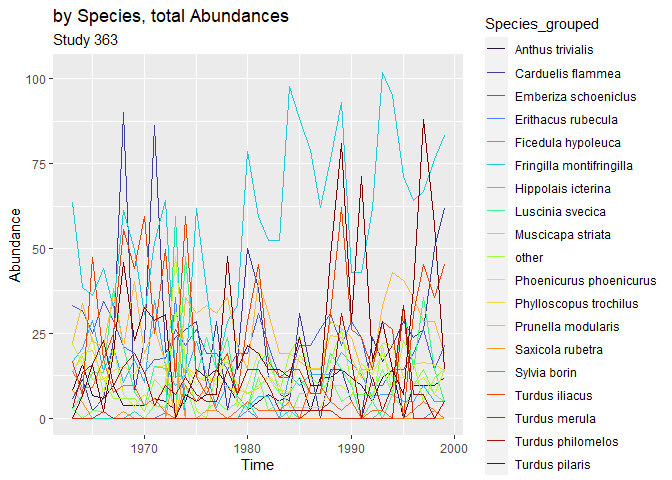<!-- -->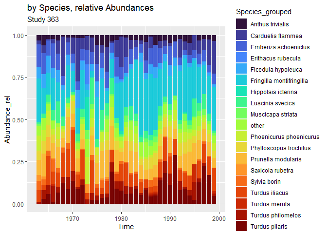<!-- -->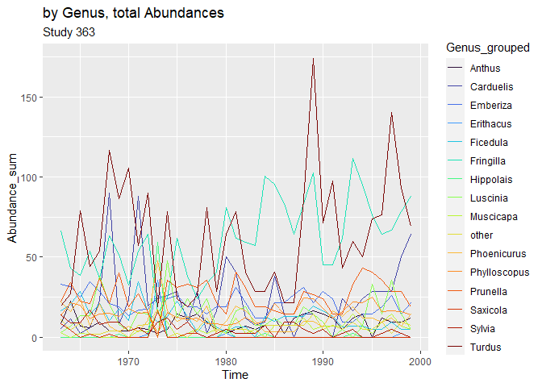<!-- -->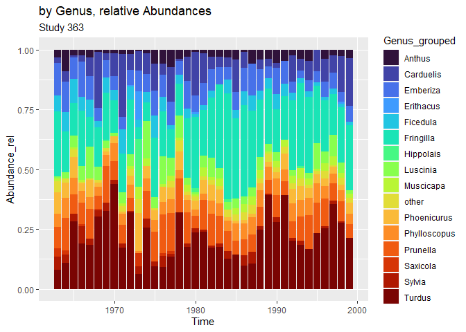<!-- -->

<br>

### other Examples

``` r
study_processing_bioTIME(study_id = 414)
```

    ## 
    ## 
    ## |Column            |Info                                                                                                   |
    ## |:-----------------|:------------------------------------------------------------------------------------------------------|
    ## |STUDY_ID          |414                                                                                                    |
    ## |REALM             |Terrestrial                                                                                            |
    ## |CLIMATE           |Temperate                                                                                              |
    ## |GENERAL_TREAT     |NA                                                                                                     |
    ## |TREATMENT         |NA                                                                                                     |
    ## |TREAT_COMMENTS    |NA                                                                                                     |
    ## |TREAT_DATE        |NA                                                                                                     |
    ## |HABITAT           |Woodland                                                                                               |
    ## |PROTECTED_AREA    |FALSE                                                                                                  |
    ## |BIOME_MAP         |Temperate grasslands, savannas and shrublands                                                          |
    ## |TAXA              |Birds                                                                                                  |
    ## |ORGANISMS         |Birds                                                                                                  |
    ## |TITLE             |Bird populations in east central Illinois. Fluctuations variations and development over a half-century |
    ## |AB_BIO            |A                                                                                                      |
    ## |HAS_PLOT          |N                                                                                                      |
    ## |DATA_POINTS       |48                                                                                                     |
    ## |START_YEAR        |1924                                                                                                   |
    ## |END_YEAR          |1976                                                                                                   |
    ## |CENT_LAT          |39.98333                                                                                               |
    ## |CENT_LONG         |-88.65                                                                                                 |
    ## |NUMBER_OF_SPECIES |48                                                                                                     |
    ## |NUMBER_OF_SAMPLES |48                                                                                                     |
    ## |NUMBER_LAT_LONG   |1                                                                                                      |
    ## |TOTAL             |963                                                                                                    |
    ## |GRAIN_SIZE_TEXT   |                                                                                                       |
    ## |GRAIN_SQ_KM       |0                                                                                                      |
    ## |AREA_SQ_KM        |5.2e-06                                                                                                |
    ## |CONTACT_1         |Author now deceased                                                                                    |
    ## |CONTACT_2         |                                                                                                       |
    ## |CONT_1_MAIL       |ideals-gen@illinois.edu                                                                                |
    ## |CONT_2_MAIL       |                                                                                                       |
    ## |LICENSE           |CC0                                                                                                    |
    ## |WEB_LINK          |https://www.ideals.illinois.edu/handle/2142/25182                                                      |
    ## |DATA_SOURCE       |IDEALS                                                                                                 |
    ## |SUMMARY_METHODS   |Bird counts                                                                                            |
    ## |LINK_ID           |NA                                                                                                     |
    ## |COMMENTS          |aggregated totals and set biomass and depth to zeros for NULLs                                         |
    ## |DATE_STUDY_ADDED  |Aug-16                                                                                                 |
    ## |ABUNDANCE_TYPE    |Density                                                                                                |
    ## |BIOMASS_TYPE      |NA                                                                                                     |
    ## |SAMPLE_DESC_NAME  |lat_long_year                                                                                          |

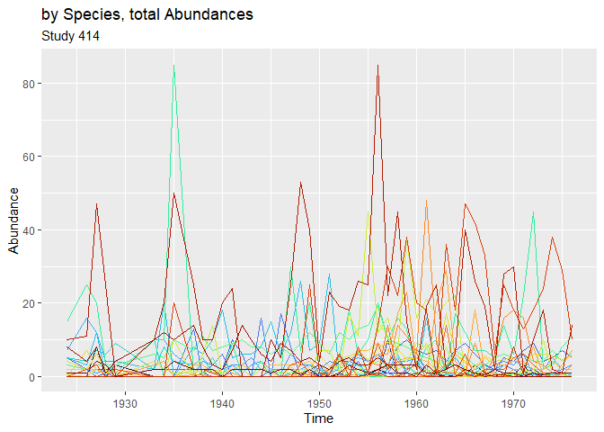<!-- -->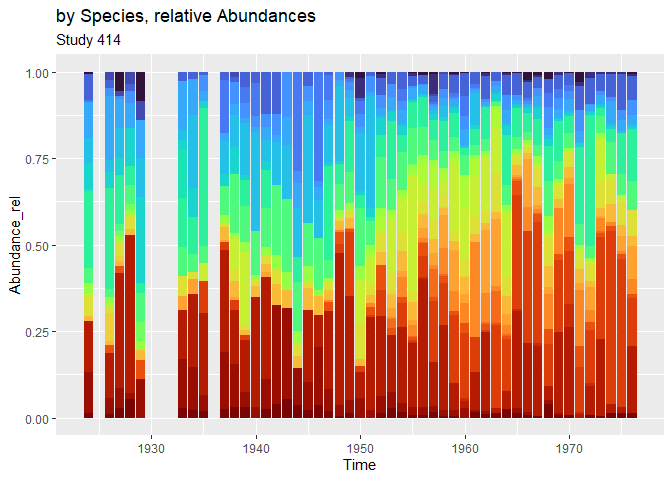<!-- -->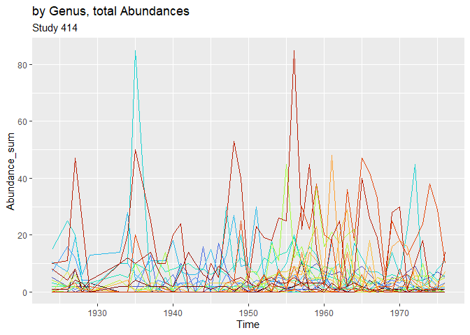<!-- -->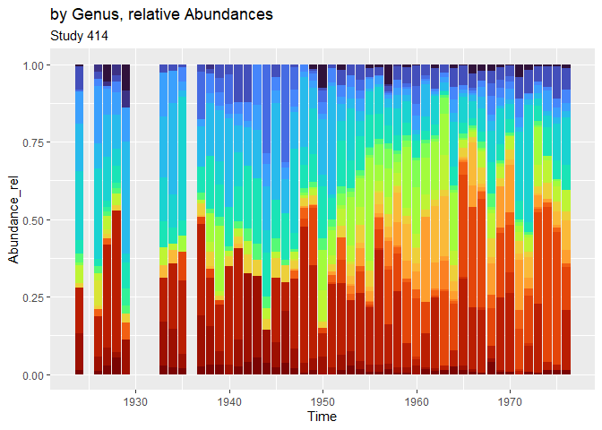<!-- -->

``` r
study_processing_bioTIME(study_id = 46, th_species = 0.01, th_genus = 0.01)
```

    ## 
    ## 
    ## |Column            |Info                                                     |
    ## |:-----------------|:--------------------------------------------------------|
    ## |STUDY_ID          |46                                                       |
    ## |REALM             |Terrestrial                                              |
    ## |CLIMATE           |Temperate                                                |
    ## |GENERAL_TREAT     |NA                                                       |
    ## |TREATMENT         |NA                                                       |
    ## |TREAT_COMMENTS    |NA                                                       |
    ## |TREAT_DATE        |NA                                                       |
    ## |HABITAT           |Woodland                                                 |
    ## |PROTECTED_AREA    |FALSE                                                    |
    ## |BIOME_MAP         |Temperate broadleaf and mixed forests                    |
    ## |TAXA              |Birds                                                    |
    ## |ORGANISMS         |breeding bird pairs                                      |
    ## |TITLE             |Skokholm Bird Observatory                                |
    ## |AB_BIO            |A                                                        |
    ## |HAS_PLOT          |S                                                        |
    ## |DATA_POINTS       |47                                                       |
    ## |START_YEAR        |1928                                                     |
    ## |END_YEAR          |1979                                                     |
    ## |CENT_LAT          |51.698                                                   |
    ## |CENT_LONG         |-5.277                                                   |
    ## |NUMBER_OF_SPECIES |29                                                       |
    ## |NUMBER_OF_SAMPLES |47                                                       |
    ## |NUMBER_LAT_LONG   |1                                                        |
    ## |TOTAL             |528                                                      |
    ## |GRAIN_SIZE_TEXT   |counts from 1 km sq                                      |
    ## |GRAIN_SQ_KM       |1                                                        |
    ## |AREA_SQ_KM        |6.45e-06                                                 |
    ## |CONTACT_1         |Mark Williamson                                          |
    ## |CONTACT_2         |                                                         |
    ## |CONT_1_MAIL       |mw1@york.ac.uk                                           |
    ## |CONT_2_MAIL       |                                                         |
    ## |LICENSE           |CC0                                                      |
    ## |WEB_LINK          |http://ecologicaldata.org/wiki/skokholm-bird-observatory |
    ## |DATA_SOURCE       |Eco Data Wiki                                            |
    ## |SUMMARY_METHODS   |Counts within defined area                               |
    ## |LINK_ID           |NA                                                       |
    ## |COMMENTS          |Dates added                                              |
    ## |DATE_STUDY_ADDED  |Oct-12                                                   |
    ## |ABUNDANCE_TYPE    |Count                                                    |
    ## |BIOMASS_TYPE      |NA                                                       |
    ## |SAMPLE_DESC_NAME  |lat_long_year                                            |

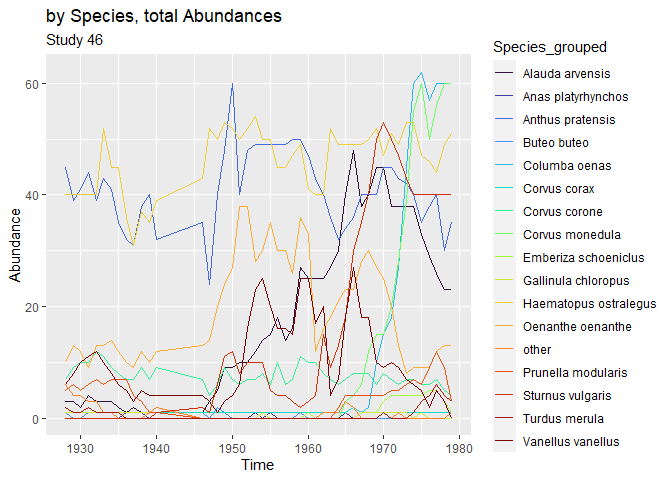<!-- -->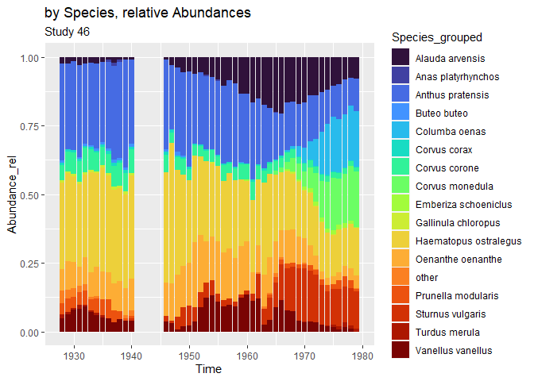<!-- --><!-- -->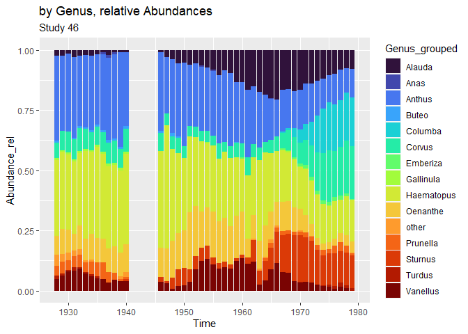<!-- -->

``` r
study_processing_bioTIME(study_id = 39)
```

    ## 
    ## 
    ## |Column            |Info                                                                                                                                                                                                                                                                                                                                                                           |
    ## |:-----------------|:------------------------------------------------------------------------------------------------------------------------------------------------------------------------------------------------------------------------------------------------------------------------------------------------------------------------------------------------------------------------------|
    ## |STUDY_ID          |39                                                                                                                                                                                                                                                                                                                                                                             |
    ## |REALM             |Terrestrial                                                                                                                                                                                                                                                                                                                                                                    |
    ## |CLIMATE           |Temperate                                                                                                                                                                                                                                                                                                                                                                      |
    ## |GENERAL_TREAT     |NA                                                                                                                                                                                                                                                                                                                                                                             |
    ## |TREATMENT         |NA                                                                                                                                                                                                                                                                                                                                                                             |
    ## |TREAT_COMMENTS    |NA                                                                                                                                                                                                                                                                                                                                                                             |
    ## |TREAT_DATE        |NA                                                                                                                                                                                                                                                                                                                                                                             |
    ## |HABITAT           |Deciduous forest                                                                                                                                                                                                                                                                                                                                                               |
    ## |PROTECTED_AREA    |FALSE                                                                                                                                                                                                                                                                                                                                                                          |
    ## |BIOME_MAP         |Temperate broadleaf and mixed forests                                                                                                                                                                                                                                                                                                                                          |
    ## |TAXA              |Birds                                                                                                                                                                                                                                                                                                                                                                          |
    ## |ORGANISMS         |birds                                                                                                                                                                                                                                                                                                                                                                          |
    ## |TITLE             |Bird community dynamics in a temperate deciduous forest Long-term trends at Hubbard Brook                                                                                                                                                                                                                                                                                      |
    ## |AB_BIO            |A                                                                                                                                                                                                                                                                                                                                                                              |
    ## |HAS_PLOT          |S                                                                                                                                                                                                                                                                                                                                                                              |
    ## |DATA_POINTS       |45                                                                                                                                                                                                                                                                                                                                                                             |
    ## |START_YEAR        |1970                                                                                                                                                                                                                                                                                                                                                                           |
    ## |END_YEAR          |2015                                                                                                                                                                                                                                                                                                                                                                           |
    ## |CENT_LAT          |43.91                                                                                                                                                                                                                                                                                                                                                                          |
    ## |CENT_LONG         |-71.75                                                                                                                                                                                                                                                                                                                                                                         |
    ## |NUMBER_OF_SPECIES |52                                                                                                                                                                                                                                                                                                                                                                             |
    ## |NUMBER_OF_SAMPLES |45                                                                                                                                                                                                                                                                                                                                                                             |
    ## |NUMBER_LAT_LONG   |1                                                                                                                                                                                                                                                                                                                                                                              |
    ## |TOTAL             |959                                                                                                                                                                                                                                                                                                                                                                            |
    ## |GRAIN_SIZE_TEXT   |50m interval plots from 500 x 100 m area                                                                                                                                                                                                                                                                                                                                       |
    ## |GRAIN_SQ_KM       |0.05                                                                                                                                                                                                                                                                                                                                                                           |
    ## |AREA_SQ_KM        |0.1                                                                                                                                                                                                                                                                                                                                                                            |
    ## |CONTACT_1         |Richard Holmes                                                                                                                                                                                                                                                                                                                                                                 |
    ## |CONTACT_2         |Tom Sherry                                                                                                                                                                                                                                                                                                                                                                     |
    ## |CONT_1_MAIL       |richard.t.holmes@dartmouth.edu                                                                                                                                                                                                                                                                                                                                                 |
    ## |CONT_2_MAIL       |tsherry@tulane.edu                                                                                                                                                                                                                                                                                                                                                             |
    ## |LICENSE           |CC-by                                                                                                                                                                                                                                                                                                                                                                          |
    ## |WEB_LINK          |http://www.esajournals.org/toc/emon/56/3                                                                                                                                                                                                                                                                                                                                       |
    ## |DATA_SOURCE       |Ecology                                                                                                                                                                                                                                                                                                                                                                        |
    ## |SUMMARY_METHODS   |Plots                                                                                                                                                                                                                                                                                                                                                                          |
    ## |LINK_ID           |NA                                                                                                                                                                                                                                                                                                                                                                             |
    ## |COMMENTS          |Removed records prior to 1986 as per provider instructions (different sampling intensities). - subsequent combining of two as per provider instructions  Where data showed t for trace (<0.5 birds per 10ha) substituted 0.2 as a numeric value for abundance.  depth and biomass NULL values set to zeroes - first part of data (to 1984) entered in OCT-12 later part JUN-16 |
    ## |DATE_STUDY_ADDED  |Oct-12                                                                                                                                                                                                                                                                                                                                                                         |
    ## |ABUNDANCE_TYPE    |Density                                                                                                                                                                                                                                                                                                                                                                        |
    ## |BIOMASS_TYPE      |NA                                                                                                                                                                                                                                                                                                                                                                             |
    ## |SAMPLE_DESC_NAME  |lat_long_timeTransect_year                                                                                                                                                                                                                                                                                                                                                     |

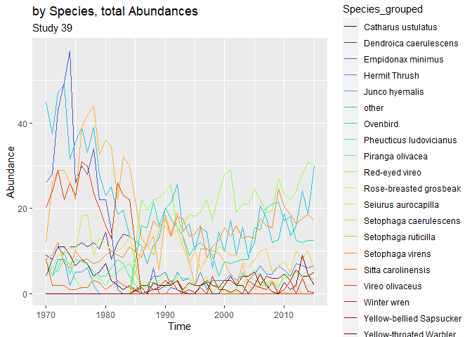<!-- -->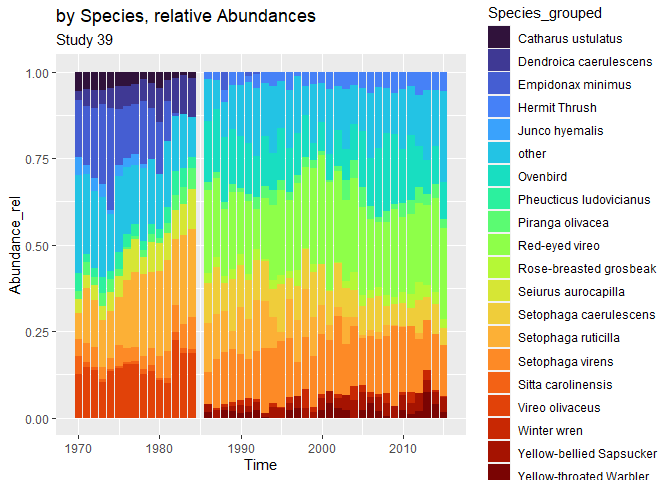<!-- -->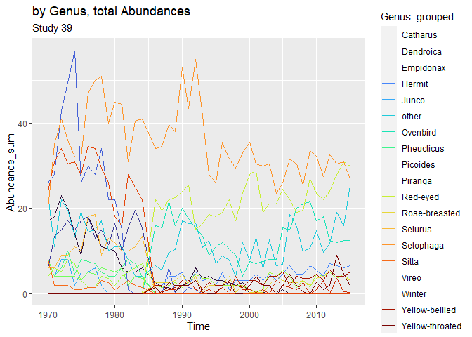<!-- -->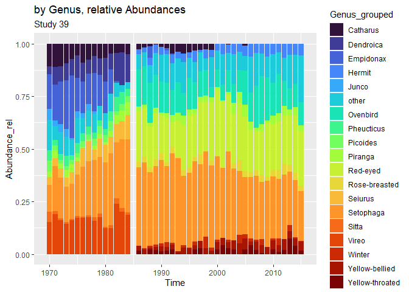<!-- -->

``` r
study_processing_bioTIME(study_id = 413, th_species = 0.08, th_genus = 0.08)
```

    ## 
    ## 
    ## |Column            |Info                                                                                                   |
    ## |:-----------------|:------------------------------------------------------------------------------------------------------|
    ## |STUDY_ID          |413                                                                                                    |
    ## |REALM             |Terrestrial                                                                                            |
    ## |CLIMATE           |Temperate                                                                                              |
    ## |GENERAL_TREAT     |NA                                                                                                     |
    ## |TREATMENT         |NA                                                                                                     |
    ## |TREAT_COMMENTS    |NA                                                                                                     |
    ## |TREAT_DATE        |NA                                                                                                     |
    ## |HABITAT           |Woodland                                                                                               |
    ## |PROTECTED_AREA    |FALSE                                                                                                  |
    ## |BIOME_MAP         |Temperate grasslands, savannas and shrublands                                                          |
    ## |TAXA              |Birds                                                                                                  |
    ## |ORGANISMS         |Birds                                                                                                  |
    ## |TITLE             |Bird populations in east central Illinois. Fluctuations variations and development over a half-century |
    ## |AB_BIO            |A                                                                                                      |
    ## |HAS_PLOT          |Y                                                                                                      |
    ## |DATA_POINTS       |44                                                                                                     |
    ## |START_YEAR        |1927                                                                                                   |
    ## |END_YEAR          |1976                                                                                                   |
    ## |CENT_LAT          |39.98333                                                                                               |
    ## |CENT_LONG         |-88.65                                                                                                 |
    ## |NUMBER_OF_SPECIES |60                                                                                                     |
    ## |NUMBER_OF_SAMPLES |177                                                                                                    |
    ## |NUMBER_LAT_LONG   |1                                                                                                      |
    ## |TOTAL             |1196                                                                                                   |
    ## |GRAIN_SIZE_TEXT   |                                                                                                       |
    ## |GRAIN_SQ_KM       |0                                                                                                      |
    ## |AREA_SQ_KM        |5.2e-06                                                                                                |
    ## |CONTACT_1         |Author now deceased                                                                                    |
    ## |CONTACT_2         |                                                                                                       |
    ## |CONT_1_MAIL       |ideals-gen@illinois.edu                                                                                |
    ## |CONT_2_MAIL       |                                                                                                       |
    ## |LICENSE           |CC0                                                                                                    |
    ## |WEB_LINK          |https://www.ideals.illinois.edu/handle/2142/25182                                                      |
    ## |DATA_SOURCE       |IDEALS                                                                                                 |
    ## |SUMMARY_METHODS   |Bird counts                                                                                            |
    ## |LINK_ID           |NA                                                                                                     |
    ## |COMMENTS          |aggregated totals and set biomass and depth to zeros for NULLs                                         |
    ## |DATE_STUDY_ADDED  |Aug-16                                                                                                 |
    ## |ABUNDANCE_TYPE    |Density                                                                                                |
    ## |BIOMASS_TYPE      |NA                                                                                                     |
    ## |SAMPLE_DESC_NAME  |lat_long_year_plotID                                                                                   |

<!-- -->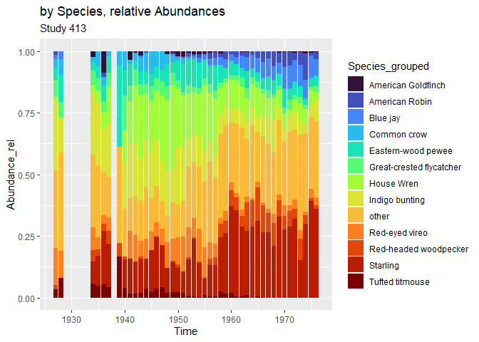<!-- -->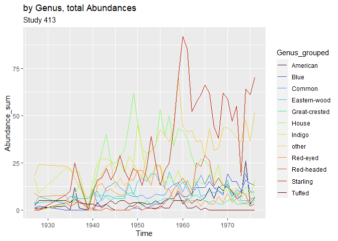<!-- -->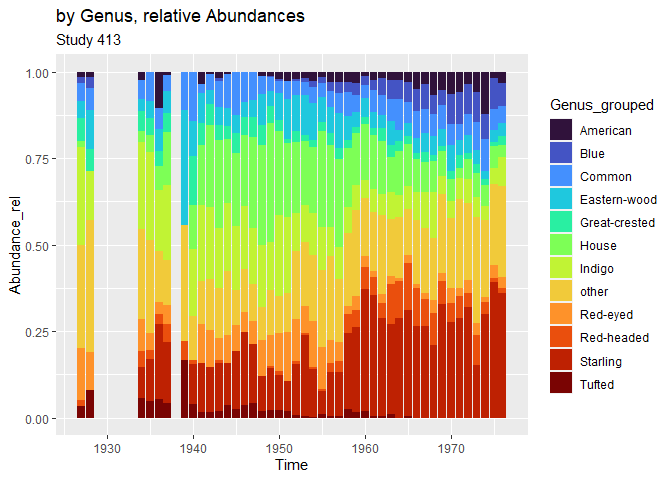<!-- -->

## Files written

These files have been written to the target directory,
`data/01a-timeseries-BioTIME`:

``` r
projthis::proj_dir_info(path_target())
```

    ## # A tibble: 39 × 4
    ##    path                                      type       size modification_time  
    ##    <fs::path>                                <fct> <fs::byt> <dttm>             
    ##  1 ps_study_339_GenusLevel.rds               file      2.22K 2023-10-22 19:03:53
    ##  2 ps_study_339_Genus_10_most_abundant.rds   file       1.5K 2023-10-22 19:03:53
    ##  3 ps_study_339_SpeciesLevel.rds             file      3.13K 2023-10-22 19:03:53
    ##  4 ps_study_339_Species_15_most_abundant.rds file      1.93K 2023-10-22 19:03:53
    ##  5 ps_study_363_GenusLevel.rds               file      1.85K 2023-10-22 19:03:53
    ##  6 ps_study_363_Genus_10_most_abundant.rds   file      1.48K 2023-10-22 19:03:53
    ##  7 ps_study_363_SpeciesLevel.rds             file      2.57K 2023-10-22 19:03:53
    ##  8 ps_study_363_Species_15_most_abundant.rds file      1.85K 2023-10-22 19:03:53
    ##  9 ps_study_39_GenusLevel.rds                file      2.49K 2023-10-22 19:03:54
    ## 10 ps_study_39_Genus_10_most_abundant.rds    file      1.41K 2023-10-22 19:03:54
    ## # ℹ 29 more rows
