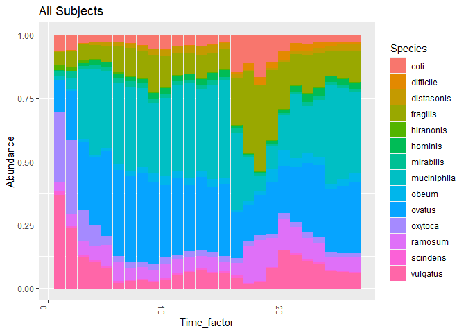
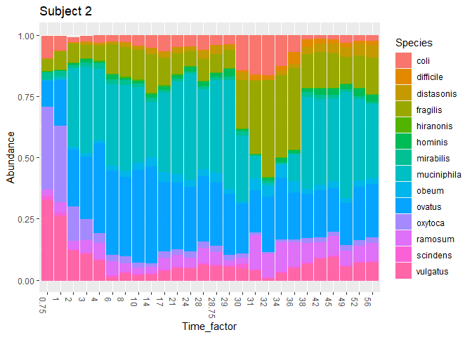
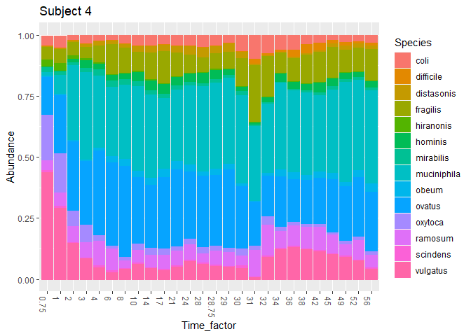
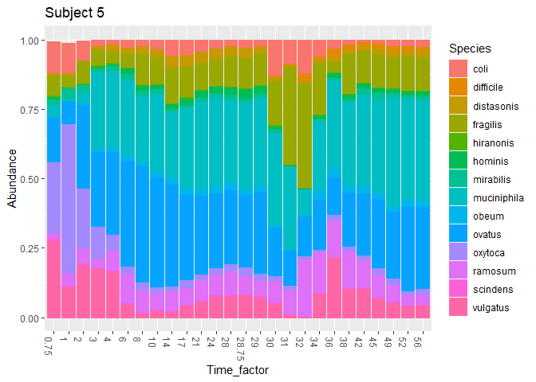

Time series (Bucci Dataset from cLV paper)
================
Compiled at 2023-11-09 10:16:06 UTC

``` r
here::i_am(paste0(params$name, ".Rmd"), uuid = "fbad9ade-134a-4a83-a801-9900003f3395")
```

In this document the pre-processing of the “Bucci” dataset from the
Compositional Lotka Volterra paper is done.

# Packages

``` r
library("conflicted")
library(tidyverse)
library(data.table)
library(viridis) # for color palettes
library(phyloseq)
library(microViz)

library(ggfortify) # to autoplot time series
```

``` r
# create or *empty* the target directory, used to write this file's data: 
projthis::proj_create_dir_target(params$name, clean = TRUE)

# function to get path to target directory: path_target("sample.csv")
path_target <- projthis::proj_path_target(params$name)

# function to get path to previous data: path_source("00-import", "sample.csv")
path_source <- projthis::proj_path_source(params$name)
```

``` r
folderpath <- 
  "input_data/clv/bucci/"
  # "C:/Users/Maria/Documents/Masterstudium/Masterarbeit/Literatur/Code/clv/data/bucci/data_cdiff/"
```

# C.diff. dataset using denoised data from cLV

Use pyhton-timeseries_Bucci_denoised.py to load and save denoised data
and take the mean over all subjects.

<!-- ```{r} -->
<!-- library(reticulate) -->
<!-- pd <- reticulate::import("pandas") -->
<!-- list_bucci_denoised <- pd$read_pickle(paste0(folderpath, "Y_cdiff-denoised.pkl")) -->
<!-- list_bucci_time <- pd$read_pickle(paste0(folderpath, "T_cdiff.pkl")) -->
<!-- ``` -->

# Bucci dataset

## Read data

``` r
#### read the file
dt_bucci_raw <- 
  fread("input_data/clv/bucci/data_cdiff/counts.txt", header = T)

knitr::kable(head(dt_bucci_raw))
```

| Species                 |    1 |    2 |    3 |   4 |    5 |    6 |    7 |    8 |    9 |   10 |   11 |   12 |   13 |   14 |   15 |  16 |   17 |   18 |   19 |   20 |   21 |   22 |   23 |   24 |   25 |   26 |   27 |   28 |  29 |  30 |   31 |   32 |   33 |   34 |   35 |   36 |   37 |   38 |   39 |   40 |   41 |   42 |   43 |   44 |   45 |   46 |   47 |   48 |   49 |  50 |   51 |  52 |   53 |   54 |  55 |   56 |  57 |   58 |   59 |   60 |   61 |   62 |   63 |   64 |   65 |   66 |   67 |   68 |   69 |   70 |   71 |   72 |   73 |   74 |   75 |   76 |   77 |  78 |   79 |   80 |  81 |  82 |   83 |   84 |   85 |   86 |   87 |   88 |   89 |   90 |  91 |   92 |  93 |  94 |   95 |  96 |  97 |   98 |   99 |  100 |  101 | 102 |  103 |  104 | 105 |  106 |  107 | 108 |  109 |  110 |  111 |  112 |  113 | 114 | 115 |  116 |  117 | 118 | 119 | 120 | 121 |  122 |  123 |  124 |  125 |  126 |  127 |  128 |  129 |  130 |
|:------------------------|-----:|-----:|-----:|----:|-----:|-----:|-----:|-----:|-----:|-----:|-----:|-----:|-----:|-----:|-----:|----:|-----:|-----:|-----:|-----:|-----:|-----:|-----:|-----:|-----:|-----:|-----:|-----:|----:|----:|-----:|-----:|-----:|-----:|-----:|-----:|-----:|-----:|-----:|-----:|-----:|-----:|-----:|-----:|-----:|-----:|-----:|-----:|-----:|----:|-----:|----:|-----:|-----:|----:|-----:|----:|-----:|-----:|-----:|-----:|-----:|-----:|-----:|-----:|-----:|-----:|-----:|-----:|-----:|-----:|-----:|-----:|-----:|-----:|-----:|-----:|----:|-----:|-----:|----:|----:|-----:|-----:|-----:|-----:|-----:|-----:|-----:|-----:|----:|-----:|----:|----:|-----:|----:|----:|-----:|-----:|-----:|-----:|----:|-----:|-----:|----:|-----:|-----:|----:|-----:|-----:|-----:|-----:|-----:|----:|----:|-----:|-----:|----:|----:|----:|----:|-----:|-----:|-----:|-----:|-----:|-----:|-----:|-----:|-----:|
| Collinsella-aerofaciens |    0 |    0 |    0 |   0 |    0 |    0 |    0 |    0 |    0 |    0 |    0 |    0 |    0 |    0 |    0 |   0 |    0 |    0 |    0 |    0 |    0 |    0 |    0 |    0 |    0 |    0 |    0 |    0 |   0 |   0 |    0 |    0 |    0 |    0 |    0 |    0 |    0 |    0 |    0 |    0 |    0 |    0 |    0 |    0 |    0 |    0 |    0 |    0 |    0 |   0 |    0 |   0 |    0 |    0 |   0 |    0 |   0 |    0 |    0 |    0 |    0 |    0 |    0 |    0 |    0 |    0 |    0 |    0 |    0 |    0 |    0 |    0 |    0 |    0 |    0 |    0 |    0 |   0 |    0 |    0 |   0 |   0 |    0 |    0 |    0 |    0 |    0 |    0 |    0 |    0 |   0 |    0 |   0 |   0 |    0 |   0 |   0 |    0 |    0 |    0 |    0 |   0 |    0 |    0 |   0 |    0 |    0 |   0 |    0 |    0 |    0 |    0 |    0 |   0 |   0 |    0 |    0 |   0 |   0 |   0 |   0 |    0 |    0 |    0 |    0 |    0 |    0 |    0 |    0 |    0 |
| Clostridium-hiranonis   | 1483 | 1416 | 1038 |  84 |  101 |   72 |   46 |   55 |   89 |  102 |  115 |   56 |  102 |   57 |   31 |  38 |    0 |    0 |    0 |    0 |    0 |    0 |    0 |    0 |    0 |    0 |  248 |  168 | 120 |  54 |  214 |   74 |  129 |   79 |  121 |  244 |   99 |   36 |   92 |   84 |   33 |   39 |    1 |    0 |    1 |    1 |    0 |    0 |    0 |   0 |    0 |   0 | 1918 | 1536 | 592 |  269 | 108 |   56 |   45 |   57 |   24 |   36 |   21 |   15 |   11 |   15 |   12 |   16 |    1 |    0 |    0 |    0 |    0 |    1 |    1 |    0 |    1 |   0 | 1331 | 1209 | 578 | 304 |  116 |   43 |   57 |   95 |   88 |  115 |  187 |   90 |  65 |   60 |  31 |  39 |    0 |   0 |   0 |    0 |    0 |    0 |    0 |   0 |    0 |    0 | 108 |   13 |   90 | 112 |   76 |   70 |   20 |   33 |   42 |  48 |  40 |   46 |   42 |  41 |  40 |  54 |   0 |    0 |    0 |    0 |    0 |    0 |    0 |    0 |    0 |    0 |
| Clostridium-difficile   |    0 |    0 |    0 |   0 |    0 |    1 |    0 |    0 |    0 |    0 |    0 |    0 |    0 |    3 |   20 | 265 | 2875 | 3204 | 3199 | 2484 | 2598 | 2453 | 1566 |  910 |  629 |  459 |    0 |    3 |   1 |   0 |    0 |    2 |    5 |    6 |    0 |    1 |    3 |    2 |    1 |    2 |   16 |  458 | 1660 | 1416 | 1961 | 2994 | 1778 | 1110 |  667 | 664 |  619 | 483 |    0 |    0 |   0 |    0 |   0 |    0 |    0 |    0 |    0 |    0 |    0 |    2 |    0 |    0 |   11 |  337 | 2403 | 2571 | 1055 | 1498 | 1028 | 1168 |  501 |  440 |  485 | 144 |    0 |    0 |   2 |   0 |    0 |    0 |    0 |    1 |    0 |    0 |    3 |    0 |   0 |    4 |  21 | 109 | 1129 | 435 | 322 | 1360 | 1888 | 1497 | 1048 | 675 |  393 |  393 |   0 |    0 |    0 |   0 |    0 |    0 |    1 |    0 |    0 |   0 |   0 |    0 |    0 |   0 |  20 | 103 | 399 | 1903 |  895 | 1720 | 1420 | 1089 |  882 |  816 |  537 |  503 |
| Proteus-mirabilis       | 1330 | 1327 | 1092 | 726 | 1271 | 1602 | 1290 | 1375 |  670 | 1093 | 1345 | 1025 | 1490 | 1152 |  727 | 926 |  159 |   20 |   72 |  166 |  105 |  600 |  467 |  520 |  512 |  341 | 2605 | 1814 | 832 | 650 | 1931 | 3404 | 2999 | 1256 | 1409 | 1191 | 1207 |  606 |  860 |  999 |  775 | 1156 |  168 | 1129 |  587 |  173 |  862 |  801 |  480 | 435 |  472 | 278 | 1472 |  827 | 738 | 1082 | 757 | 1010 | 1056 |  872 |  720 |  573 |  684 |  909 |  750 | 1096 | 1064 | 2002 |  619 |   56 |  108 |   62 |  143 |  435 |  725 |  465 |  679 | 254 |  880 |  606 | 413 | 736 | 1247 | 1065 | 1043 |  887 |  843 |  778 |  937 |  598 | 651 |  715 | 394 | 661 |  231 | 109 |  65 |  154 |  235 |  414 |  601 | 440 |  548 |  407 | 364 | 2023 | 1396 | 811 | 1067 | 1415 | 1166 |  992 |  523 | 430 | 477 |  722 |  616 | 535 | 442 | 930 |  40 |  110 |  403 |  425 |  618 | 1118 | 1120 |  657 |  449 |  509 |
| Clostridium-scindens    | 1065 |  460 |  199 |  98 |  209 |  343 |  195 |  234 |  120 |  255 |  194 |  120 |  154 |  197 |  144 | 493 |   48 |   43 |   22 |   54 |  154 |  329 |  113 |   79 |   75 |   98 | 1266 | 1009 | 324 |  90 |  210 |  746 |  544 |  166 |  151 |  363 |  408 |  150 |  279 |  256 |  106 |  943 |   88 |  120 |  125 |  102 |  132 |  153 |  130 | 118 |  131 |  63 |  236 |  177 |  94 |   60 | 103 |  182 |  327 |  183 |   87 |  262 |  176 |  153 |  154 |  216 |  254 |  255 |   88 |    9 |   87 |  245 |  124 |  189 |  115 |  169 |   99 |  46 |  223 |  220 |  50 | 123 |  185 |  160 |  132 |  119 |   78 |  122 |  224 |  140 | 160 |  166 | 116 | 330 |   20 |  75 |  67 |   91 |   35 |  104 |   85 |  63 |   80 |  125 |  91 |   37 |  291 |  54 |   93 |  265 |  208 |  208 |  121 |  80 |  68 |  134 |   81 |  72 |  90 | 153 |  23 |   73 |   53 |   68 |   79 |   92 |   88 |  122 |   68 |   72 |
| Ruminococcus-obeum      |   30 |  408 | 1405 | 312 |  754 | 1322 | 1301 | 1931 | 2064 | 3734 | 2338 | 1555 | 1835 | 2094 | 1171 | 210 |  370 |    2 | 4888 | 8381 | 2435 | 3235 | 1791 | 1828 | 2743 | 3213 |    3 |    8 | 834 | 465 |  828 | 2992 | 3278 | 1913 | 2837 | 3848 | 3614 | 2183 | 2326 | 3558 | 1240 |  378 | 3685 | 3719 | 5261 | 2721 |  859 | 1208 | 1085 | 754 | 1374 | 854 |   13 |  137 | 875 |  272 | 322 |  971 | 1269 | 1034 | 2218 | 1902 | 1534 | 1247 | 1062 | 1319 | 1260 |  260 |   28 |    2 | 2340 | 2703 | 1452 | 2893 | 1228 | 1160 | 1316 | 753 |   23 |  194 |  85 | 213 |  497 |  982 | 1578 | 1410 | 1636 | 1724 | 2220 | 1379 | 996 | 1379 | 890 | 433 |   77 | 363 | 947 | 1143 |  829 | 1046 | 1137 | 602 | 1414 | 1542 |  49 |    3 |   73 | 560 |  717 |  984 |  575 | 1125 | 1425 | 993 | 820 | 1385 | 1105 | 736 | 732 | 402 | 203 |  114 | 2056 | 1655 | 1488 | 1636 | 1267 | 1012 | 1102 | 1276 |

``` r
# read metadata file
dt_bucci_meta <-
  fread("input_data/clv/bucci/data_cdiff/metadata.txt", header = T) %>% 
  .[, Time := measurementid] %>% 
  .[, Time_factor := ordered(Time)] %>% 
  .[, measurementid := NULL]

head(dt_bucci_meta)
```

    ##    sampleID isIncluded subjectID perturbid exptblock intv Time Time_factor
    ## 1:        1          1         1         0         1    0 0.75        0.75
    ## 2:        2          1         1         0         1    0 1.00           1
    ## 3:        3          1         1         0         1   14 2.00           2
    ## 4:        4          1         1         0         1    0 3.00           3
    ## 5:        5          1         1         0         1    0 4.00           4
    ## 6:        6          1         1         0         1    0 6.00           6

``` r
# read taxonomic information
dt_tax_bucci <-
  fread(paste0(folderpath, "data_cdiff/taxonomy_table.csv"), header = T)
```

## Info

… on the time points: When was the data collected?

Fecal pellets were collected at days 0.75, 1, 2, 3, 4, 6, 8, 10, 14, 17,
21, 24, and 28 of the initial colonization and at days 0.75, 1, 2, 3, 4,
6, 8, 10, 14, 17, 21, 24, and 28 post-infection with C. difficile.

–\> Time (prev. measurementid)

## Phyloseq

### Prepare otu table

``` r
mat_otu_bucci <-
  dt_bucci_raw %>%
    tibble::column_to_rownames("Species")
colnames(mat_otu_bucci) <-
  sprintf("ID-%03d", as.numeric(colnames(mat_otu_bucci)))

OTU_bucci = otu_table(mat_otu_bucci, taxa_are_rows = TRUE)
```

### Prepare sample table (metadata)

``` r
mat_samples_bucci <-
  copy(dt_bucci_meta) %>% 
  .[, sampleID := sprintf("ID-%03d", sampleID)] %>%
  tibble::column_to_rownames("sampleID") 

samples_bucci = sample_data(mat_samples_bucci)
```

### Generate taxonomic table

``` r
mat_tax_bucci <-
  dt_tax_bucci %>% 
  tibble::column_to_rownames("Names") 

TAX_bucci = tax_table(as.matrix(mat_tax_bucci))
```

### Create phyloseq object

``` r
ps_bucci_all <- phyloseq(OTU_bucci, TAX_bucci, samples_bucci)
```

## Calculate relative abundances

``` r
# change count data to relative counts

ps_bucci_rel <- 
  ps_bucci_all %>% 
  transform_sample_counts(function(x) x / sum(x))
```

## Filter for relevant taxa

``` r
# two possibilities
ps_bucci_all <-
  ps_bucci_all %>%
      filter_taxa(function(x)
        {sum(x > 5) > (0.2 * nsamples(.))},
        TRUE)

ps_bucci_all <-
  ps_bucci_all %>%
      filter_taxa(function(x)
        mean(x) > 50,
        # mean(x) > 1e-3, # for relative values
        TRUE)


# filter for most abundant species
ps_bucci_rel <-
  ps_bucci_rel %>%
      filter_taxa(function(x)
        mean(x) > 1e-3, # for relative values
        TRUE)

# list mean of abundances for each species
occuring_freq <-
  psmelt(ps_bucci_rel) %>%
  as.data.table() %>%
  .[, .(mean_Abundance = round(mean(Abundance),4)), by = Species] %>%
  .[order(-mean_Abundance)]
occuring_freq
```

    ##         Species mean_Abundance
    ##  1: muciniphila         0.2652
    ##  2:      ovatus         0.2596
    ##  3:    fragilis         0.1297
    ##  4:    vulgatus         0.0869
    ##  5:     ramosum         0.0744
    ##  6:        coli         0.0520
    ##  7:     oxytoca         0.0445
    ##  8:       obeum         0.0220
    ##  9:     hominis         0.0208
    ## 10:  distasonis         0.0166
    ## 11:   mirabilis         0.0131
    ## 12:   difficile         0.0092
    ## 13:    scindens         0.0029
    ## 14:   hiranonis         0.0023

### Devide dataset by subjects

``` r
# get a subset for each subject 

ps_bucci_1 <-
  subset_samples(ps_bucci_rel, subjectID == 1)

ps_bucci_2 <-
  subset_samples(ps_bucci_rel, subjectID == 2)

ps_bucci_3 <-
  subset_samples(ps_bucci_rel, subjectID == 3)

ps_bucci_4 <-
  subset_samples(ps_bucci_rel, subjectID == 4)

ps_bucci_5 <-
  subset_samples(ps_bucci_rel, subjectID == 5)
```

### Get one dataset, that contains mean of all subjects in one

``` r
ps_bucci_mean <-
  # summarize over all subject at each time point
  merge_samples(ps_bucci_all, "Time") %>% 
  # take the mean (devide abundance by number of subjects)
  transform_sample_counts(function(x) x / sum(x))
```

### Overview of datasets (and their taxonimic levels)

``` r
ps_bucci_1
```

    ## phyloseq-class experiment-level object
    ## otu_table()   OTU Table:         [ 14 taxa and 26 samples ]
    ## sample_data() Sample Data:       [ 26 samples by 7 sample variables ]
    ## tax_table()   Taxonomy Table:    [ 14 taxa by 7 taxonomic ranks ]

``` r
ps_bucci_2
```

    ## phyloseq-class experiment-level object
    ## otu_table()   OTU Table:         [ 14 taxa and 26 samples ]
    ## sample_data() Sample Data:       [ 26 samples by 7 sample variables ]
    ## tax_table()   Taxonomy Table:    [ 14 taxa by 7 taxonomic ranks ]

``` r
ps_bucci_3
```

    ## phyloseq-class experiment-level object
    ## otu_table()   OTU Table:         [ 14 taxa and 26 samples ]
    ## sample_data() Sample Data:       [ 26 samples by 7 sample variables ]
    ## tax_table()   Taxonomy Table:    [ 14 taxa by 7 taxonomic ranks ]

``` r
ps_bucci_4
```

    ## phyloseq-class experiment-level object
    ## otu_table()   OTU Table:         [ 14 taxa and 26 samples ]
    ## sample_data() Sample Data:       [ 26 samples by 7 sample variables ]
    ## tax_table()   Taxonomy Table:    [ 14 taxa by 7 taxonomic ranks ]

``` r
ps_bucci_5
```

    ## phyloseq-class experiment-level object
    ## otu_table()   OTU Table:         [ 14 taxa and 26 samples ]
    ## sample_data() Sample Data:       [ 26 samples by 7 sample variables ]
    ## tax_table()   Taxonomy Table:    [ 14 taxa by 7 taxonomic ranks ]

``` r
# # summarize how many unique levels are available for each taxonomic rank
# # (for overview table)
# for(subject in c(seq(5), "all")){
#   cat("----------------------------------")
#   cat("\n")
#   cat("Subject ", subject, "\n")
#   cat("----------------------------------\n")
#   for(tax_rank in c("Kingdom", "Phylum", "Class", "Order", "Family", "Genus", "Species")) {
#     cat(tax_rank, ": \t")
#     cat(" uniqueN:   ", tax_table(get(paste0("ps_bucci_", subject)))[, tax_rank] %>% uniqueN(), "\n")
#     cat("\t\t NAs:       ", (sum(is.na(tax_table(get(paste0("ps_bucci_", subject)))[, tax_rank]))), "\n")
#   }
#   cat("\n")
# }
```

### plot data

``` r
# plot for all subjects
plot_bar(ps_bucci_mean,
         x = "Time_factor",
         fill = "Species",
         title = "All Subjects") +
  geom_bar(aes(color=Species, fill=Species), stat="identity", position="stack")
```

<!-- -->

``` r
# plots for each subject separately
for (id in 1:5) {
  plt_tmp <-
    plot_bar(get(paste0("ps_bucci_", id)),
             x = "Time_factor",
             fill = "Species",
             title = paste("Subject", id)) +
    geom_bar(aes(color=Species, fill=Species), stat="identity", position="stack")
  
  print(plt_tmp)
}
```

<!-- --><!-- --><!-- --><!-- --><!-- -->

## Save Phyloseq Objects

``` r
for (id in c(1:5, "mean")) {
  saveRDS(get(paste0("ps_bucci_", id)),
          path_target(paste0("ps_bucci_subject_", id, "_rel_counts_most_abundant.rds")))
}
```

## Files written

These files have been written to the target directory,
`data/01b-timeseries-CLVpaper`:

``` r
projthis::proj_dir_info(path_target())
```

    ## # A tibble: 6 × 4
    ##   path                                           type   size modification_time  
    ##   <fs::path>                                     <fct> <fs:> <dttm>             
    ## 1 …_bucci_subject_1_rel_counts_most_abundant.rds file  3.96K 2023-11-09 10:16:16
    ## 2 …_bucci_subject_2_rel_counts_most_abundant.rds file  4.05K 2023-11-09 10:16:16
    ## 3 …_bucci_subject_3_rel_counts_most_abundant.rds file  4.01K 2023-11-09 10:16:16
    ## 4 …_bucci_subject_4_rel_counts_most_abundant.rds file     4K 2023-11-09 10:16:16
    ## 5 …_bucci_subject_5_rel_counts_most_abundant.rds file  3.97K 2023-11-09 10:16:16
    ## 6 …cci_subject_mean_rel_counts_most_abundant.rds file  3.96K 2023-11-09 10:16:16
