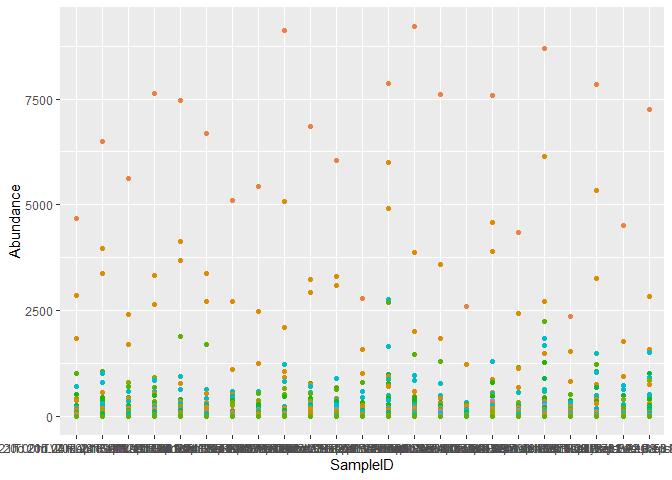
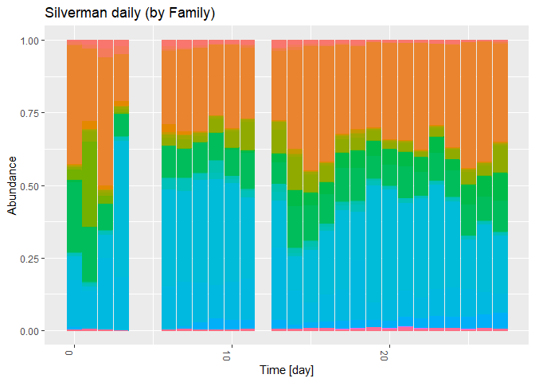
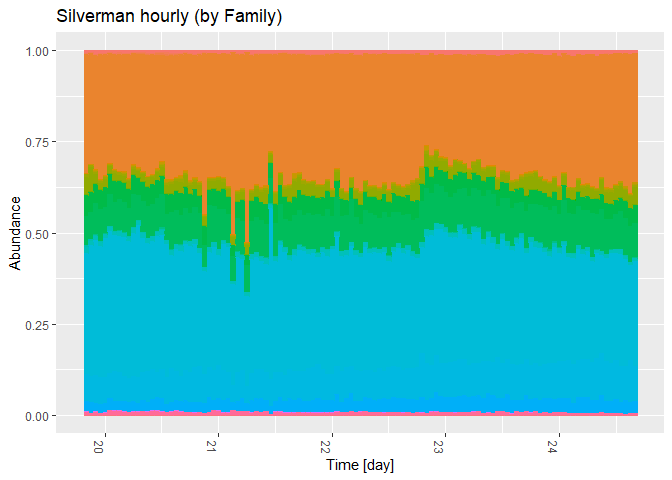
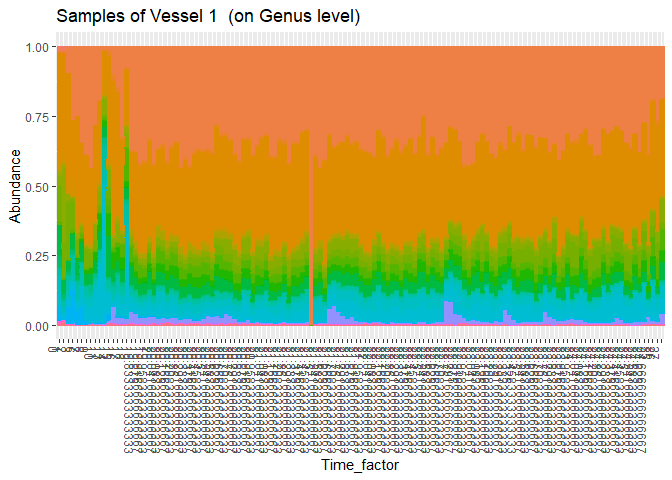
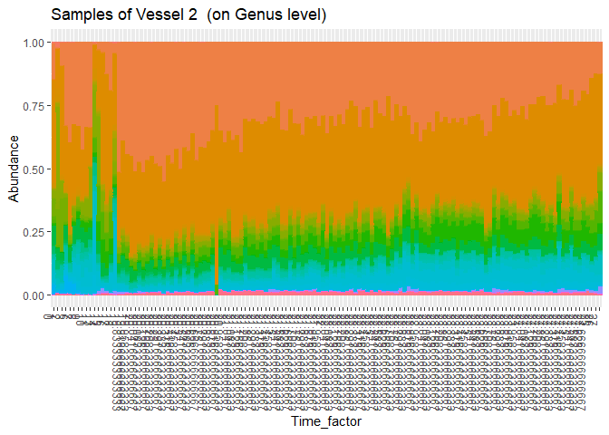
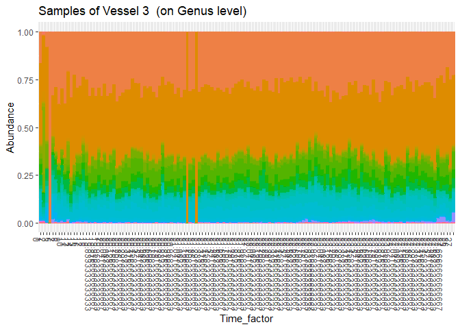
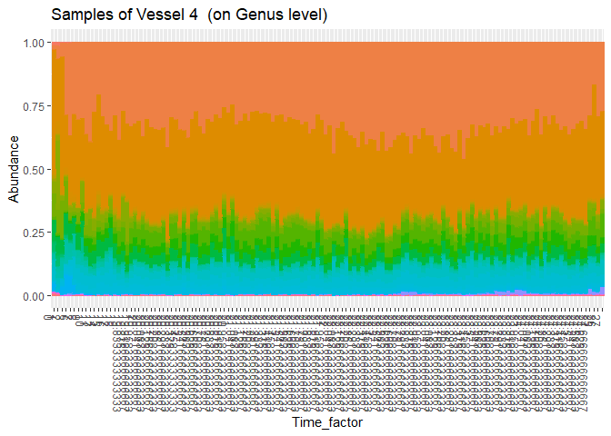
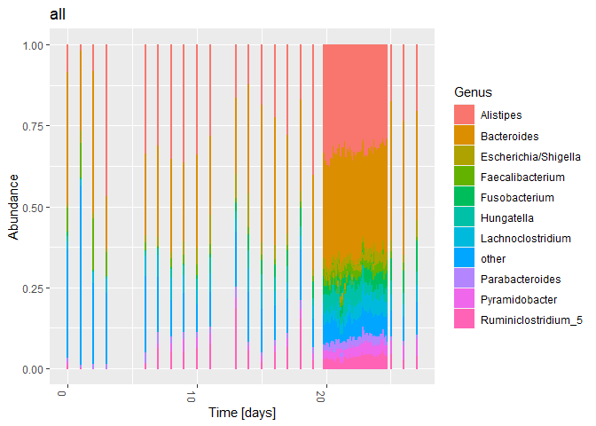
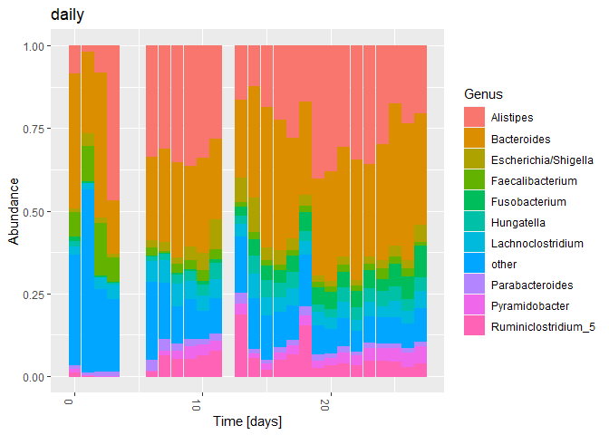
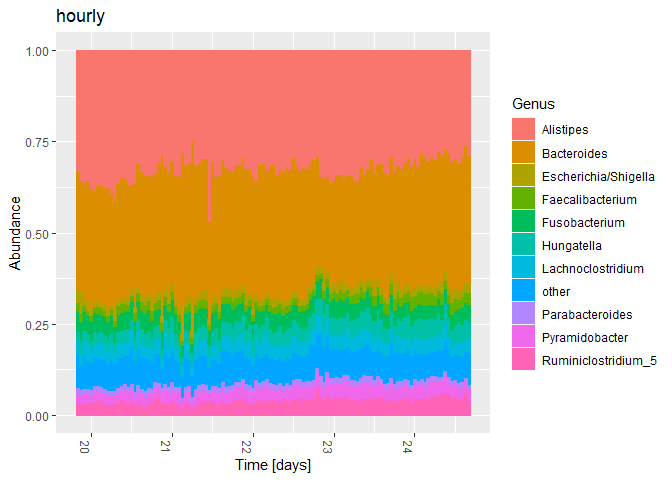

Time series (miaTime)
================
Compiled at 2023-11-06 22:44:54 UTC

``` r
here::i_am(paste0(params$name, ".Rmd"), uuid = "87d828ae-2f1b-40a8-b559-3784df62c78d")
```

# Packages

``` r
library("conflicted")
library(data.table)
library(dplyr)
library(ggplot2)
library(viridis) # for color palettes 
library(stringr)

library(miaTime)
library(mia)

library(phyloseq)
library(microViz) # for ps_reorder()
library(biomeUtils) # for removeZeros()
library("xlsx")
```

``` r
# create or *empty* the target directory, used to write this file's data: 
projthis::proj_create_dir_target(params$name, clean = TRUE)

# function to get path to target directory: path_target("sample.csv")
path_target <- projthis::proj_path_target(params$name)

# function to get path to previous data: path_source("00-import", "sample.csv")
path_source <- projthis::proj_path_source(params$name)
```

## Load dataset (SilvermanAGutData)

``` r
# load the Silverman artificial gut data set from miaTIME

data(SilvermanAGutData)
```

## Make Phyloseq

``` r
# make phyloseq object out of TSE object
ps_Silverman <- makePhyloseqFromTreeSE(SilvermanAGutData)
```

### Remove zero samples

There are some samples with only 0 entries in the otu table. These
samples are removed from the dataset.

``` r
# print names of samples with zero counts over all otus (colSum == 0)
zero_samples <-
  otu_table(ps_Silverman)[,colSums(otu_table(ps_Silverman)) == 0] %>%
  sample_names()
zero_samples
```

    ## [1] "T..19d.21h.00m.V2.Rep1.set.3.10..Well.B2"
    ## [2] "T..20d.10h.00m.V4.Rep1.set.3.13..Well.E2"
    ## [3] "T..20d.17h.00m.V2.Rep1.Set.4.86..WellF11"
    ## [4] "T..22d.20h.00m.V1.Rep1.set.3.9..Well.A2" 
    ## [5] "T..23d.10h.00m.V1.Rep1.set.3.48.Well.H6"

``` r
# remove above samples from the dataset
ps_Silverman <- 
  subset_samples(ps_Silverman, !(SampleID %in% zero_samples))
```

### Rename NAs or unknown taxonomic ranks in tax_table

``` r
tax_table(ps_Silverman)[is.na(tax_table(ps_Silverman)) | 
                          tax_table(ps_Silverman) == ""] <- "unknown"
```

For Species/Genus/etc. were the name is unknown, we set their name to
“unknown_Level_count”. In this formulation, “Level” is the taxonomic
level and “count” counts threw the number of unknowns at this rank. In
the Species column for example the unknowns will then have names like
“unknown_Species_1”, “unknown_Species_2”, etc.

``` r
physeq <- ps_Silverman

# Access the taxonomy table from the phyloseq object
taxonomy_table <- tax_table(physeq)

# Function to rename unknown taxa at a specific level
rename_unknown_taxa <- function(taxonomy, level) {
  unknown_taxa <- grepl("unknown", taxonomy[, level], ignore.case = TRUE)
  num_unknown_taxa <- sum(unknown_taxa)
  renamed_taxa <- character(num_unknown_taxa)
  
  for (i in 1:num_unknown_taxa) {
    renamed_taxa[i] <- paste("unknown_", level, "_", i, sep = "")
  }
  
  taxonomy[unknown_taxa, level] <- renamed_taxa
  return(taxonomy)
}

# List of taxonomic levels to rename
taxonomic_levels <- c("Kingdom", "Phylum", "Class", "Order", "Family", "Genus", "Species")

# Iterate through taxonomic levels and rename unknown taxa
for (level in taxonomic_levels) {
  taxonomy_table <- rename_unknown_taxa(taxonomy_table, level)
}

# Assign the updated taxonomy table back to the phyloseq object
tax_table(physeq) <- taxonomy_table

# Assign phyloseq object back to original ps
ps_Silverman <- physeq
```

### Add date to sample info in phyloseq

Since the exact date of each sample is not clearly provided in the meta
data, we extract the date information (day and hour) from the sample
name.

``` r
# extract time info from the sample names

# create columns for day/hour info
sample_names <- sample_names(ps_Silverman)
sample_cols <- 
  data.table(names = sample_names,
             day = tstrsplit(sample_names, "\\.")[[3]],
             hours = str_extract(sample_names, "[0-9][0-9]h")) %>% 
  # format days and hours as numeric
  .[, day := as.numeric(str_remove(day, "d"))] %>% 
  .[, hours := as.numeric(str_remove(hours, "h"))] %>% 
  # set time to decimal value in days
  .[, time := day + hours/24] %>% 
  .[is.na(hours), time := day]
```

``` r
# Create dataframe including Time (in days) info out of rownames
sam.new <- data.frame(Time = sample_cols$time)
# Mix up the sample names (just for demonstration purposes)
rownames(sam.new) <- sample_cols$names

# Turn into `sample_data` 
sam.new <- sample_data(sam.new)

ps_Silverman <- merge_phyloseq(ps_Silverman, sam.new)
# head(sample_data(ps_Silverman))
```

### Remove samples of day 28

Further, day 28 is the last day of the study and is removed from our
data, since multiple samples are available which complicates their
handling.

``` r
# remove samples of day 28 from analysis
ps_Silverman <-
  subset_samples(ps_Silverman, Time < 28)
```

### Duplicates

There are still some duplicated samples regarding time. These are listed
below:

``` r
# duplicates in Time/Vessel/SampleType:
get_all_duplicates <- function(data_phylo){
  data <- sample_data(data_phylo) # %>% subset(data, Time < 28)
  data_TVS <-
    data[, c("Time", "Vessel", "SampleType")]
  res <-
    data[duplicated(data_TVS) |
           duplicated(data_TVS, fromLast = T)]
  setorder(res, Vessel, Time)
  return(res)
}

# vector with all duplicated SampleIDs
duplicated_samples_ID <-
  get_all_duplicates(ps_Silverman)$SampleID

# subset of data set only including duplicates
ps_Silverman_duplicates <-
  subset_samples(ps_Silverman, SampleID %in% duplicated_samples_ID) %>% 
  ps_reorder(duplicated_samples_ID)

# plot abundances of duplicates
# plot_bar(ps_Silverman_duplicates, fill = "Species") + 
#   theme(legend.position = "none",
#         axis.text.x = element_blank())
ggplot(psmelt(ps_Silverman_duplicates),
       aes(x = SampleID, y = Abundance, col = Genus)) +
  geom_point() + 
  theme(legend.position = "none")
```

<!-- -->

``` r
# # show otu table of all duplicates (zero entries excluded)
# removeZeros(ps_Silverman_duplicates) %>% otu_table() %>% view()

write.xlsx(
  otu_table(removeZeros(ps_Silverman_duplicates)),
  paste0(path_target(), "/duplicated_samples.xlsx"),
  sheetName = "Sheet1",
  col.names = TRUE,
  row.names = TRUE,
  append = FALSE
)

# subset of data set not including duplicated samples
ps_Silverman_unique <-
  subset_samples(ps_Silverman, !(SampleID %in% duplicated_samples_ID))
```

#### Get mean for duplicates

``` r
# load this R script which slightly modifies the merge_sample function of phyloseq package
source("../R/functions/merge-methods-modified.R")
```

We here generate an additional phyloseq object (called
“ps_Silverman_noDuplicates”) containing all samples of SilvermanAGutData
as follows: all counts for unique samples as they are and for the
duplicates the mean counts over these duplicated samples.

``` r
# add group for merging
# therefore only use first part of sampleID name which is the same for each duplicates
sample_data(ps_Silverman_duplicates)$SampleID_new <-
  sample_data(ps_Silverman_duplicates)$SampleID %>%
  gsub("Rep1.*", "Rep1", .) %>%
  gsub("Rep.1.*", "Rep.1", .) %>%
  paste0(".merged")

# define the function how to merge the sample data
# for numeric values: take mean
# for other values: unique and paste values (separated by ;)
merge_fun <- function(x, fun = mean){
  if(is.numeric(x)){
    fun(x)
  } else {
    paste(unique(x), collapse = ";")
    # if(uniqueN(x) > 1){
    #   return(NA)
    # } else{
    #   return(unique(x))
    # }
  }
}

# use modified version of merge_samples to merge all duplicates and set mean count in otu table
ps_Silverman_merged <-
  modmerge_samples(ps_Silverman_duplicates,
                group = "SampleID_new",
                fun = merge_fun)

# redefine SampleID and remove SampleID_new
sample_data(ps_Silverman_merged)$SampleID <- 
  sample_data(ps_Silverman_merged)$SampleID_new
sample_data(ps_Silverman_merged)$SampleID_new <- NULL

# merge mean values of duplicates to unique values of Silverman data set
ps_Silverman_noDuplicates <-
  merge_phyloseq(ps_Silverman_unique, ps_Silverman_merged)
```

``` r
# replace duplicates with mean entries in original data set
ps_Silverman <- 
  ps_Silverman_noDuplicates

# add time as.factor for plots
sample_data(ps_Silverman)$Time_factor <-
  ordered(sample_data(ps_Silverman)$Time)
```

### Subsets

Create subsets for each vessel and for daily/hourly samples.

``` r
# transform counts to relative abundance
ps_Silverman <-
  transform_sample_counts(ps_Silverman,
                          function(x) x / sum(x))

# # set resulting NAs to zero
# otu_table(ps_Silverman)[is.na(otu_table(ps_Silverman))] <- 0
# # --> not needed since "Remove zero samples" was done previously


# devide into daily and hourly samples

ps_Silverman_daily <- 
  # subset_samples(ps_Silverman, SampleType=="Daily")
  subset_samples(ps_Silverman, Time == as.integer(Time))

ps_Silverman_hourly <- 
  # subset_samples(ps_Silverman, SampleType=="Hourly")
  subset_samples(ps_Silverman, Time > 19 & Time < 25)


# devide by Vessels
for(vessel in 1:4){
  assign(paste0("ps_Silverman_V", vessel),
         subset_samples(ps_Silverman, 
                        Vessel == vessel))
  assign(paste0("ps_Silverman_daily_V", vessel),
         subset_samples(ps_Silverman_daily, 
                        Vessel == vessel))
  assign(paste0("ps_Silverman_hourly_V", vessel),
         subset_samples(ps_Silverman_hourly, 
                        Vessel == vessel))
}
```

### Mean subsets

``` r
# Get a dataset, that contains mean over all vessels in one
ps_Silverman_mean_all <- copy(ps_Silverman)
sample_data(ps_Silverman_mean_all) <- 
  sample_data(ps_Silverman_mean_all)[, c("Time", "Time_factor")]
ps_Silverman_mean_all <-
  merge_samples(ps_Silverman_mean_all, group = "Time") %>% 
  transform_sample_counts(function(x) x / sum(x))

# devide into daily and hourly samples
ps_Silverman_mean_daily <- 
  subset_samples(ps_Silverman_mean_all, Time == as.integer(Time))
ps_Silverman_mean_hourly <- 
  subset_samples(ps_Silverman_mean_all, Time > 19 & Time < 25)
```

### Plots

``` r
# whole daily dataset
plot_bar(ps_Silverman_mean_daily, x = "Time", fill = "Family") +
  theme(legend.position = "none") +
  geom_bar(aes(color=Family, fill=Family), stat="identity", position="stack") +
  labs(title = "Silverman daily (by Family)",
       x = "Time [day]")
```

<!-- -->

``` r
# whole hourly dataset
plot_bar(ps_Silverman_mean_hourly, x = "Time", fill = "Family") +
  theme(legend.position = "none") +
  geom_bar(aes(color=Family, fill=Family), stat="identity", position="stack") +
  labs(title = "Silverman hourly (by Family)",
       x = "Time [day]")
```

<!-- -->

``` r
# plots for each vessel
for (vessel in 1:4) {
  plt_tmp <-
    plot_bar(get(paste0("ps_Silverman_V", vessel)),
             x = "Time_factor", fill = "Genus",
             title = paste("Samples of Vessel", vessel, " (on Genus level)")) +
    theme(legend.position = "none") +
    geom_bar(aes(color = Genus, fill = Genus),
             stat = "identity",
             position = "stack")
  print(plt_tmp)
}
```

<!-- --><!-- --><!-- --><!-- -->

## Save phyloseq objects as csv file

``` r
saveRDS(ps_Silverman,
        path_target("ps_Silverman_rel_counts.rds"))

# data vessel wise
for (vessel in c(1:4)) {
  saveRDS(get(paste0("ps_Silverman_V", vessel)),
          path_target(paste0("ps_Silverman_V", vessel, "_rel_counts.rds")))
}

# daily/hourly and data over all time points (mean over all Vessels)
saveRDS(ps_Silverman_mean_daily,
        path_target("ps_Silverman_Vall_daily_rel_counts.rds"))
saveRDS(ps_Silverman_mean_hourly,
        path_target("ps_Silverman_Vall_hourly_rel_counts.rds"))
saveRDS(ps_Silverman_mean_all,
        path_target("ps_Silverman_Vall_all_rel_counts.rds"))
```

## Aggregate the dataset to the 10 most abundant Genera

### Filter for the most abundant taxa are

``` r
for(time_type in c("all", "daily", "hourly")){
  ps_tmp <- get(paste0("ps_Silverman_mean_", time_type))
  
  data <-
    ps_tmp %>% 
    psmelt() %>%
    as_tibble()
  
  # get Genera with highest abundance (sum over all Counts for each Genus)
  most_abundant_genera <-
    data %>%
      group_by(Genus) %>%
      summarise(Sum_Abundance = sum(Abundance)) %>% # another possible criteria would be mean(Abundance)
      arrange(-Sum_Abundance) %>%
      .[1:10, "Genus"] %>% 
    as.vector()

  # Rename genera that are not in most_abundant_genera to "other"
  ps_tmp <- ps_tmp %>%
    tax_mutate(Genus = if_else(
      Genus %in% most_abundant_genera$Genus,
      as.character(Genus),
      "other"
    ))
  
  # select only Genus and Species column of tax_table
  tax_table(ps_tmp) <- tax_table(ps_tmp)[, c("Genus", "Species")]
  
  ps_tmp <- ps_tmp %>%
    # summarize over tax level, include NAs
    tax_glom(taxrank = "Genus", NArm = FALSE) %>%
    speedyseq::transmute_tax_table(Genus, .otu = Genus)

  assign(paste0("ps_Silverman_mean_", time_type, "_Genus_10_most_abundant"),
         ps_tmp)
}
```

### Transform counts to relative abundances

``` r
ps_Silverman_mean_all_Genus_10_most_abundant_rel_counts <-
  transform_sample_counts(ps_Silverman_mean_all_Genus_10_most_abundant,
                          function(x) x / sum(x) )

ps_Silverman_mean_daily_Genus_10_most_abundant_rel_counts <-
  transform_sample_counts(ps_Silverman_mean_daily_Genus_10_most_abundant,
                          function(x) x / sum(x) )

ps_Silverman_mean_hourly_Genus_10_most_abundant_rel_counts <-
  transform_sample_counts(ps_Silverman_mean_hourly_Genus_10_most_abundant,
                          function(x) x / sum(x) )
```

### Plot Phyloseq objects (relative counts)

``` r
# plot all time_types on Family level
for(time_type in c("all", "daily", "hourly")){
  plt_tmp <-
    plot_bar(get(paste0("ps_Silverman_mean_", time_type, "_Genus_10_most_abundant_rel_counts")),
             x = "Time", fill = "Genus") +
    # theme(legend.position = "none") +
    labs(title = time_type,
         x = "Time [days]") +
    geom_bar(aes(color = Genus, fill = Genus),
             stat = "identity",
             position = "stack")
  print(plt_tmp)
}
```

<!-- --><!-- --><!-- -->

### Save these time series as csv files

``` r
for(time_type in c("all", "daily", "hourly")) { 
  
  # get the tmp phyloseq object
  ps_tmp <- get(paste0("ps_Silverman_mean_", time_type, "_Genus_10_most_abundant_rel_counts"))
  
  if(taxa_are_rows(ps_tmp)) {
    otu_tmp <- t(otu_table(ps_tmp))
  } else {
    otu_tmp <- otu_table(ps_tmp)
  }
  # combine count data with time information
  ts_tmp <-
    cbind(sample_data(ps_tmp)[, "Time"],
          otu_tmp)
  ts_tmp <- ts_tmp[order(ts_tmp$Time), ]
  
  # save time series as csv file
  write.csv(
    ts_tmp,
    path_target(paste0("ts_Silverman_Vall_", time_type, "_Genus_10_most_abundant_rel_counts.csv")),
    row.names = F
  )
}
```

<!-- ```{r, message=FALSE} -->
<!-- # saving for vesselwise datasets with 10 most abundant genera -->
<!-- # Warning: Genera are not equal over all vessels !!! -->
<!-- for(time_type in c( "daily", "hourly")) { -->
<!--   for(vessel in 1:4){ -->
<!--     # get the tmp phyloseq object -->
<!--     ps_tmp <- get(paste0("ps_Silverman_", time_type, "_V", vessel, "_Genus_10_most_abundant_rel_counts")) -->
<!--     if(taxa_are_rows(ps_tmp)) { -->
<!--       otu_tmp <- t(otu_table(ps_tmp)) -->
<!--     } else { -->
<!--       otu_tmp <- otu_table(ps_tmp) -->
<!--     } -->
<!--     # combine count data with time information -->
<!--     ts_tmp <- -->
<!--       cbind(sample_data(ps_tmp)[, "Time"], -->
<!--             otu_tmp) -->
<!--     ts_tmp <- ts_tmp[order(ts_tmp$Time), ] -->
<!--     ts_tmp <- -->
<!--       subset(ts_tmp,!Time %in% c(19.875, 21.125, 21.25, -->
<!--                                  (21 + 11 / 24), (23 + 10 / 24))) # 100% Bacteroides at these samples -->
<!--     # save time series as csv file -->
<!--     write.csv( -->
<!--       ts_tmp, -->
<!--       path_target(paste0("ts_Silverman_Vall_", time_type, "_V", vessel, -->
<!--                          "_Genus_10_most_abundant_rel_counts.csv")), -->
<!--       row.names = F -->
<!--     ) -->
<!--   } -->
<!-- } -->
<!-- ``` -->

## Files written

These files have been written to the target directory,
`data/01c-timeseries-miaTIME`:

``` r
projthis::proj_dir_info(path_target())
```

    ## # A tibble: 12 × 4
    ##    path                                        type     size modification_time  
    ##    <fs::path>                                  <fct> <fs::b> <dttm>             
    ##  1 duplicated_samples.xlsx                     file   13.77K 2023-11-06 22:45:08
    ##  2 ps_Silverman_rel_counts.rds                 file  365.48K 2023-11-06 22:46:06
    ##  3 ps_Silverman_V1_rel_counts.rds              file  173.96K 2023-11-06 22:46:06
    ##  4 ps_Silverman_V2_rel_counts.rds              file  178.29K 2023-11-06 22:46:06
    ##  5 ps_Silverman_V3_rel_counts.rds              file  174.68K 2023-11-06 22:46:06
    ##  6 ps_Silverman_V4_rel_counts.rds              file  178.63K 2023-11-06 22:46:06
    ##  7 ps_Silverman_Vall_all_rel_counts.rds        file  107.61K 2023-11-06 22:46:06
    ##  8 ps_Silverman_Vall_daily_rel_counts.rds      file   34.08K 2023-11-06 22:46:06
    ##  9 ps_Silverman_Vall_hourly_rel_counts.rds     file   92.59K 2023-11-06 22:46:06
    ## 10 …_all_Genus_10_most_abundant_rel_counts.csv file   29.47K 2023-11-06 22:46:11
    ## 11 …aily_Genus_10_most_abundant_rel_counts.csv file    5.33K 2023-11-06 22:46:11
    ## 12 …urly_Genus_10_most_abundant_rel_counts.csv file   25.35K 2023-11-06 22:46:11
