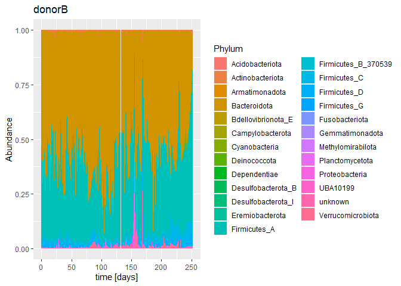
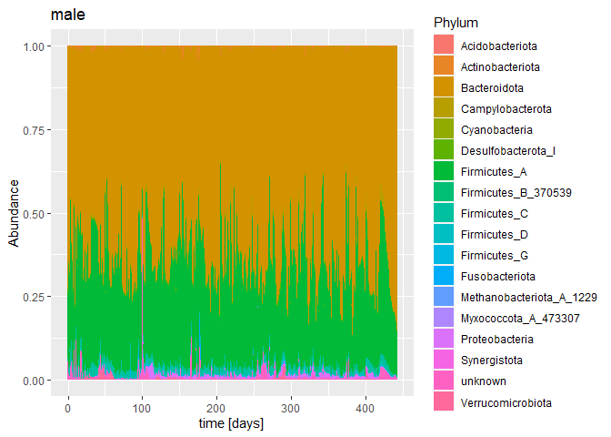

01d-timeseries-HumanGutData-Karwowska-paper
================
Compiled at 2023-07-31 15:14:52 UTC

``` r
here::i_am(paste0(params$name, ".Rmd"), uuid = "4435c437-d4bf-4c0c-a851-45bef7011c59")
```

The purpose of this document is to import the four human gut microbiome
time series datasets that were already pre-processed in the paper “”
from Karwowska et.al.

``` r
library("conflicted")
library(tidyverse)
library(data.table)
library(phyloseq)
```

``` r
# create or *empty* the target directory, used to write this file's data: 
projthis::proj_create_dir_target(params$name, clean = TRUE)

# function to get path to target directory: path_target("sample.csv")
path_target <- projthis::proj_path_target(params$name)

# function to get path to previous data: path_source("00-import", "sample.csv")
path_source <- projthis::proj_path_source(params$name)
```

## Read data sets

``` r
# set path to the folder where the data files are in
filepath_data <- 
  "C:/Users/Maria/Documents/Masterstudium/Masterarbeit/Literatur/Code/dynamo/data/data/"

# vector of all four subject names
four_subjects <-
  c("donorA", "donorB", "male", "female")

# read data files (otu tables - interpolated)
for(subject in four_subjects){
  tmp <- 
    as.matrix(fread(paste0(filepath_data, "ready_files/", subject,
                      "_rarefied_18000_interpolated_pchip.tsv"),
               header = T), rownames = 1) %>% 
    otu_table(taxa_are_rows = T)
  
  assign(paste0("otu_", subject),
         tmp)
}

# read taxonomic tables
for(subject in four_subjects){
  if(subject %in% c("donorA", "donorB")){
    tmp <- 
      fread(paste0(filepath_data, "taxonomy/2202_taxonomy.tsv"), header = T)
  } else {
    tmp <- 
      fread(paste0(filepath_data, "taxonomy/", subject, "_taxonomy.tsv"), 
            header = T)
  }
  
  tax_cols <-
    c("Kingdom", "Phylum", "Class", "Order", "Family", "Genus", "Species")
  tmp[, (tax_cols) := tstrsplit(Taxon, ";")] %>% 
    .[, (tax_cols) := lapply(.SD, sub, pattern = ".*__", replacement = ""), 
      .SDcols =  tax_cols] %>% 
    .[, Taxon := NULL]
  assign(paste0("tax_", subject),
         tmp)
}

# read metadata
metadata <-
  fread(paste0(filepath_data, "raw_files/2202_metadata.tsv"))

# # set time for sample data
# for(subject in four_subjects){
#   tmp <- colnames(get(paste0("otu_", subject))) %>% 
#     data.frame(ID = ., Time = as.numeric(.)) %>% 
#     tibble::column_to_rownames("ID")
#   assign(paste0("sample_", subject),
#          tmp)
# }
```

## Make Phyloseq

``` r
# make phyloseq objects out of otu and tax tables

for(subject in four_subjects){
  tmp_tax <- 
    get(paste0("tax_", subject)) %>%
    tibble::column_to_rownames("Feature ID") %>%
    as.matrix() %>%
    tax_table()

  assign(paste0("ps_", subject),
         phyloseq(get(paste0("otu_", subject)),
                  tmp_tax))
}
```

## Plot Phyloseq

``` r
# bar plot phyloseq objects
for(subject in four_subjects){
  plt_tmp <-
    ggplot(psmelt(get(paste0("ps_", subject))),
           aes(as.numeric(Sample), Abundance, fill = Family)) +
    geom_bar(stat = "identity")  +
    theme(legend.position = "none") +
    labs(title = subject,
         x = "time [days]")
  print(plt_tmp)
}
```

<!-- --><!-- --><!-- --><!-- -->

``` r
# # alternative way of plotting
# for(subject in four_subjects){
#   plt_tmp <-
#     plot_bar(get(paste0("ps_", subject)), x = "as.numeric(Sample)", fill = "Family") +
#     theme(legend.position = "none") +
#     labs(title = subject,
#          x = "Time [days]")
#   print(plt_tmp)
# }
```

## Files written

These files have been written to the target directory,
`data/01d-timeseries-HumanGutData-Karwowska-paper`:

``` r
projthis::proj_dir_info(path_target())
```

    ## # A tibble: 0 × 4
    ## # ℹ 4 variables: path <fs::path>, type <fct>, size <fs::bytes>,
    ## #   modification_time <dttm>
