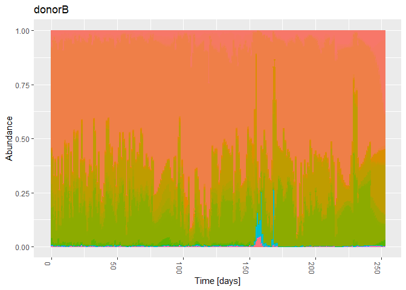
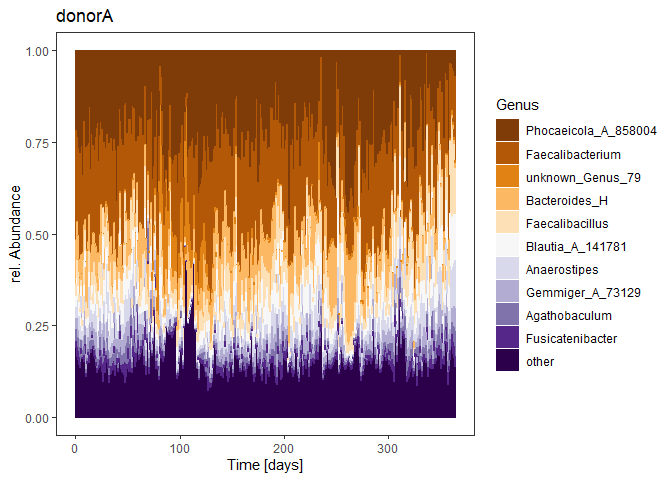
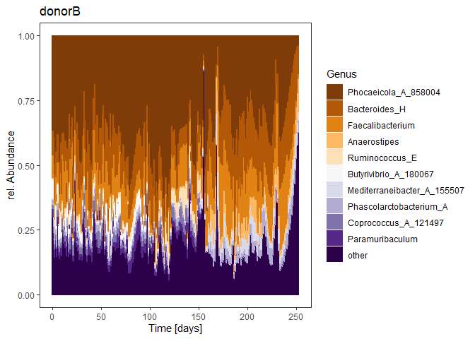
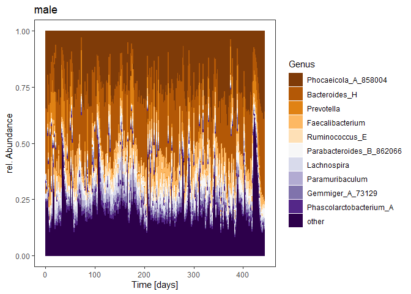
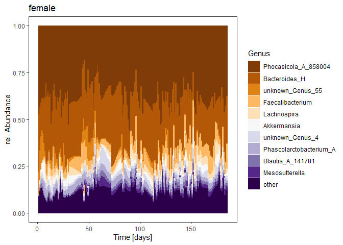

01d-timeseries-HumanGutData-Karwowska-paper
================
Compiled at 2023-11-09 10:35:42 UTC

``` r
here::i_am(paste0(params$name, ".Rmd"), uuid = "4435c437-d4bf-4c0c-a851-45bef7011c59")
```

The purpose of this document is to import the four human gut microbiome
time series datasets that were already pre-processed in the paper “”
from Karwowska et.al.

``` r
library("conflicted")
library(tidyverse)
library(data.table)
library(phyloseq)
library(microViz)
library(viridis)
```

``` r
# create or *empty* the target directory, used to write this file's data: 
projthis::proj_create_dir_target(params$name, clean = TRUE)

# function to get path to target directory: path_target("sample.csv")
path_target <- projthis::proj_path_target(params$name)

# function to get path to previous data: path_source("00-import", "sample.csv")
path_source <- projthis::proj_path_source(params$name)
```

## Read data sets

``` r
# set path to the folder where the data files are in
filepath_data <- 
  "input_data/humanTS_data/"

# vector of all four subject names
four_subjects <-
  c("donorA", "donorB", "male", "female")

# read data files (otu tables - interpolated)
# extract abundance info into otu_table and Time info into sample_table
for(subject in four_subjects){
  tmp_dt <- 
    fread(paste0(filepath_data, "ready_files/", subject,
                 "_rarefied_18000_interpolated_pchip.tsv"),
          header = T)
  # write sample names in format "ID-001"
  tmp_names <- 
    sprintf("ID-%03d", as.numeric(colnames(tmp_dt)[2:length(tmp_dt)]))

  # create sample info table with columns "SampleID" and "Time"
  tmp_sample <-
    data.table(SampleID = tmp_names,
               Time = as.numeric(colnames(tmp_dt)[2:length(tmp_dt)]))
  
  # update sample names in otu table
  colnames(tmp_dt)[2:length(tmp_dt)] <- tmp_names
  tmp_otu <-
    as.matrix(tmp_dt, rownames = 1) %>% 
    otu_table(taxa_are_rows = T)
  
  assign(paste0("otu_", subject),
         tmp_otu) 
  assign(paste0("sample_", subject),
         tmp_sample)
}

# read taxonomic tables
for(subject in four_subjects){
  if(subject %in% c("donorA", "donorB")){
    tmp <- 
      fread(paste0(filepath_data, "taxonomy/2202_taxonomy.tsv"), header = T)
  } else {
    tmp <- 
      fread(paste0(filepath_data, "taxonomy/", subject, "_taxonomy.tsv"), 
            header = T)
  }
  
  tax_cols <-
    c("Kingdom", "Phylum", "Class", "Order", "Family", "Genus", "Species")
  tmp[, (tax_cols) := tstrsplit(Taxon, ";")] %>%
    # remove "d__", "p__", etc. in front of taxonomic ranks
    .[, (tax_cols) := lapply(.SD, sub, pattern = ".*__", replacement = ""),
      .SDcols =  tax_cols] %>%
    # remove columns that contain listed taxonomic ranks and confidence value
    .[, c("Taxon", "Confidence") := NULL]
  # replace NAs with "unknown"
  tmp[is.na(tmp) | tmp == ""] <- "unknown"
  
  assign(paste0("tax_", subject),
         tmp)
}

# read additional metadata for donorA and donorB
metadata <-
  fread(paste0(filepath_data, "raw_files/2202_metadata.tsv"))

# 
metadata_donorAStool <-
  subset(metadata, description == "DonorA Stool") %>% 
  .[!duplicated(collection_day)]
metadata_donorBStool <-
  subset(metadata, description == "DonorB Stool") %>% 
  .[!duplicated(collection_day)]

# add additional metadata for 
sample_donorA <-
  merge(sample_donorA, metadata_donorAStool,
        by.x = "Time", by.y = "collection_day", all.x = T)
sample_donorB <-
  merge(sample_donorB, metadata_donorBStool,
        by.x = "Time", by.y = "collection_day", all.x = T)

# bring sample_data tables in the right format
for(subject in four_subjects) {
  tmp <- get(paste0("sample_", subject)) %>%
    tibble::column_to_rownames("SampleID")
  
  assign(paste0("sample_", subject), sample_data(tmp))
}
```

## Make Phyloseq

``` r
# make phyloseq objects out of otu and tax tables

for(subject in four_subjects){
  tmp_tax <- 
    get(paste0("tax_", subject)) %>%
    tibble::column_to_rownames("Feature ID") %>%
    as.matrix() %>%
    tax_table()

  assign(paste0("ps_", subject),
         phyloseq(get(paste0("otu_", subject)),
                  tmp_tax,
                  get(paste0("sample_", subject))))
}
```

<!-- ```{r} -->
<!-- # summarize number of unique levels are available for each taxonomic rank -->
<!-- # (for overview table) -->
<!-- for(subject in four_subjects){ -->
<!--   cat("----------------------------------") -->
<!--   cat("\n") -->
<!--   cat(subject, "\n") -->
<!--   cat("----------------------------------\n") -->
<!--   for(tax_rank in c("Kingdom", "Phylum", "Class", "Order", "Family", "Genus", "Species")) { -->
<!--     cat(tax_rank, ": \t") -->
<!--     cat(" uniqueN:   ", tax_table(get(paste0("ps_", subject)))[, tax_rank] %>% uniqueN(), "\n") -->
<!--     cat("\t\t NAs:       ", (sum(tax_table(get(paste0("ps_", subject)))[, tax_rank] == "unknown")), "\n") -->
<!--   } -->
<!--   cat("\n") -->
<!-- } -->
<!-- ``` -->

## Rename unknown taxonomic ranks

For Species/Genus/etc. were the name is unknown, we set the to
“unknown_Level_count”, where Level is the taxonomic level and count
counts threw the number of unknowns at this rank. In the Species column
for example the unknowns would have names like “unknown_Species_1”,
“unknown_Species_2”, etc.

``` r
for(subject in four_subjects){
  physeq <- get(paste0("ps_", subject))

  # Access the taxonomy table from the phyloseq object
  taxonomy_table <- tax_table(physeq)
  
  # Function to rename unknown taxa at a specific level
  rename_unknown_taxa <- function(taxonomy, level) {
    unknown_taxa <- grepl("unknown", taxonomy[, level], ignore.case = TRUE)
    num_unknown_taxa <- sum(unknown_taxa)
    renamed_taxa <- character(num_unknown_taxa)
    
    for (i in 1:num_unknown_taxa) {
      renamed_taxa[i] <- paste("unknown_", level, "_", i, sep = "")
    }
    
    taxonomy[unknown_taxa, level] <- renamed_taxa
    return(taxonomy)
  }
  
  # List of taxonomic levels to rename
  taxonomic_levels <- c("Kingdom", "Phylum", "Class", "Order", "Family", "Genus", "Species")
  
  # Iterate through taxonomic levels and rename unknown taxa
  for (level in taxonomic_levels) {
    taxonomy_table <- rename_unknown_taxa(taxonomy_table, level)
  }
  
  # Assign the updated taxonomy table back to the phyloseq object
  tax_table(physeq) <- taxonomy_table
  
  # Assign phyloseq object back to original ps
  assign(paste0("ps_", subject), physeq)
}
```

## Overview Phyloseq Objects

``` r
ps_donorA
```

    ## phyloseq-class experiment-level object
    ## otu_table()   OTU Table:         [ 1524 taxa and 365 samples ]
    ## sample_data() Sample Data:       [ 365 samples by 57 sample variables ]
    ## tax_table()   Taxonomy Table:    [ 1524 taxa by 7 taxonomic ranks ]

``` r
ps_donorB
```

    ## phyloseq-class experiment-level object
    ## otu_table()   OTU Table:         [ 1569 taxa and 253 samples ]
    ## sample_data() Sample Data:       [ 253 samples by 57 sample variables ]
    ## tax_table()   Taxonomy Table:    [ 1569 taxa by 7 taxonomic ranks ]

``` r
ps_male
```

    ## phyloseq-class experiment-level object
    ## otu_table()   OTU Table:         [ 1253 taxa and 443 samples ]
    ## sample_data() Sample Data:       [ 443 samples by 1 sample variables ]
    ## tax_table()   Taxonomy Table:    [ 1253 taxa by 7 taxonomic ranks ]

``` r
ps_female
```

    ## phyloseq-class experiment-level object
    ## otu_table()   OTU Table:         [ 551 taxa and 185 samples ]
    ## sample_data() Sample Data:       [ 185 samples by 1 sample variables ]
    ## tax_table()   Taxonomy Table:    [ 551 taxa by 7 taxonomic ranks ]

## Transform counts to relative abundances

``` r
ps_donorA_rel_counts <-
  transform_sample_counts(ps_donorA, function(x) x / sum(x) )

ps_donorB_rel_counts <-
  transform_sample_counts(ps_donorB, function(x) x / sum(x) )

ps_male_rel_counts <-
  transform_sample_counts(ps_male, function(x) x / sum(x) )

ps_female_rel_counts <-
  transform_sample_counts(ps_female, function(x) x / sum(x) )
```

## Plot Phyloseq objects (relative counts) on Family level

``` r
# plot all subjects on Family level
for(subject in four_subjects){
  plt_tmp <-
    plot_bar(get(paste0("ps_", subject, "_rel_counts")),
             x = "Time", fill = "Family") +
    theme(legend.position = "none") +
    labs(title = subject,
         x = "Time [days]") +
    geom_bar(aes(color = Family, fill = Family),
             stat = "identity",
             position = "stack")
  print(plt_tmp)
}
```

<!-- --><!-- --><!-- --><!-- -->

## Save Phyloseq Objects

``` r
for(subject in four_subjects){
  # save ps with absolute counts
  saveRDS(get(paste0("ps_", subject)),
          path_target(paste0("ps_", subject, ".rds")))
  # save ps with relative counts
  saveRDS(get(paste0("ps_", subject, "_rel_counts")),
          path_target(paste0("ps_", subject, "_rel_counts.rds")))
}
```

## Summarize over 10 most abundant Genera

### Check what the most abundant taxa are

``` r
for(subject in four_subjects){
  ps_tmp <- get(paste0("ps_", subject))
  
  data <-
    ps_tmp %>% 
    psmelt() %>%
    as_tibble()
  
  # get Genera with highest abundance (sum over all Counts for each Genus)
  most_abundant_genera <-
    data %>%
      group_by(Genus) %>%
      summarise(Sum_Abundance = sum(Abundance)) %>% # another possible criteria would be mean(Abundance)
      arrange(-Sum_Abundance) %>%
      .[1:10, "Genus"] %>% 
    as.vector()

  # Rename genera that are not in most_abundant_genera to "other"
  ps_tmp <- ps_tmp %>%
    tax_mutate(Genus = if_else(
      Genus %in% most_abundant_genera$Genus,
      as.character(Genus),
      "other"
    ))
  
  # select only Genus and Species column of tax_table
  tax_table(ps_tmp) <- tax_table(ps_tmp)[, c("Genus", "Species")]
  
  ps_tmp <- ps_tmp %>%
    # summarize over tax level, include NAs
    tax_glom(taxrank = "Genus", NArm = FALSE) %>%
    speedyseq::transmute_tax_table(Genus, .otu = Genus)

  assign(paste0("ps_", subject, "_Genus_10_most_abundant"),
         ps_tmp)
}
```

### Transform counts to relative abundances

``` r
ps_donorA_Genus_10_most_abundant_rel_counts <-
  transform_sample_counts(ps_donorA_Genus_10_most_abundant,
                          function(x) x / sum(x) )

ps_donorB_Genus_10_most_abundant_rel_counts <-
  transform_sample_counts(ps_donorB_Genus_10_most_abundant,
                          function(x) x / sum(x) )

ps_male_Genus_10_most_abundant_rel_counts <-
  transform_sample_counts(ps_male_Genus_10_most_abundant,
                          function(x) x / sum(x) )

ps_female_Genus_10_most_abundant_rel_counts <-
  transform_sample_counts(ps_female_Genus_10_most_abundant, 
                          function(x) x / sum(x) )
```

### Plot Phyloseq objects (relative counts)

``` r
# calculate mean of Genus "other" over all samples
for(subject in four_subjects) {
  ps_tmp <-
    get(paste0("ps_", subject, "_Genus_10_most_abundant_rel_counts"))
  
  # Extract OTU Table
  otu_table_df <- as.data.frame(otu_table(ps_tmp))
  
  # Calculating the mean
  mean_other <-
    mean(as.numeric(otu_table_df["other",]), na.rm = TRUE)
  
  assign(paste0(subject, "_mean_other"), mean_other)
}
```

``` r
# choose color palette
col_palette <- 
    c('#7f3b08','#b35806','#e08214','#fdb863','#fee0b6','#f7f7f7','#d8daeb','#b2abd2','#8073ac','#542788','#2d004b')
    # c('#543005','#8c510a','#bf812d','#dfc27d','#f6e8c3','#f5f5f5','#c7eae5','#80cdc1','#35978f','#01665e','#003c30')
    # c('#67001f','#b2182b','#d6604d','#f4a582','#fddbc7','#f7f7f7','#d1e5f0','#92c5de','#4393c3','#2166ac','#053061')
```

``` r
# plot all subjects on Genus level
for(subject in four_subjects){
  # Extract the phyloseq object
  ps_tmp <- get(paste0("ps_", subject, "_Genus_10_most_abundant_rel_counts"))
  
  # Transform Phyloseq to Data Frame
  df_for_plotting <- psmelt(ps_tmp)
  
  # Adjust Factor Levels to move Genus "other" to the end
  genus_order <- c(setdiff(df_for_plotting$Genus, "other"), "other")
  df_for_plotting$Genus <- factor(df_for_plotting$Genus, levels = genus_order)
  
  # Create a lighter turbo-like color palette
  lighter_turbo <-
    viridis(n = length(levels(df_for_plotting$Genus)), option = "turbo", begin = 0.05, end = 0.85, direction = 1)
 
  # mean_other = get(paste0(subject, "mean_other_"))

  # Plot with ggplot2
  plt_tmp <- ggplot(df_for_plotting, aes(x = Time, y = Abundance, fill = Genus)) +
    geom_bar(stat = "identity", position = "stack", aes(color = Genus)) +
    labs(title = subject, x = "Time [days]", y = "rel. Abundance") +
    theme_bw() +
    theme(panel.grid.major = element_blank(),
          panel.grid.minor = element_blank()) +
    # # add horizontal line for mean over "other"
    # geom_hline(yintercept = mean_other, linetype = "dashed", color = "black") +
    # annotate("text", x = Inf, y = mean_other, label = sprintf("Mean: %.2f", mean_other), 
    #          vjust = 1.5, hjust = 1) + 
    scale_fill_manual(values = col_palette) +
    scale_color_manual(values = col_palette)
  
  # Show the plot
  print(plt_tmp)
    
  # Save the plot
  ggsave(path_target(paste0("plot_", subject, "Genus10_rel_counts.pdf")),
         plt_tmp, width = 7, height = 4)
}
```

<!-- --><!-- --><!-- --><!-- -->

### Save these time series as csv files

``` r
for(subject in four_subjects) { 
  
  # get the tmp phyloseq object
  ps_tmp <- get(paste0("ps_", subject, "_Genus_10_most_abundant"))
  
  if(taxa_are_rows(ps_tmp)) {
    otu_tmp <- t(otu_table(ps_tmp))
  } else {
    otu_tmp <- otu_table(ps_tmp)
  }
  # combine count data with time information
  ts_tmp <-
    cbind(sample_data(ps_tmp)[, "Time"],
          otu_tmp)
  
  # save time series as csv file
  write.csv(
    ts_tmp,
    path_target(paste0("ts_", subject, "_Genus_10_most_abundant.csv")),
    row.names = F
  )
}
```

``` r
for(subject in four_subjects) { 
  
  # get the tmp phyloseq object
  ps_tmp <- get(paste0("ps_", subject, "_Genus_10_most_abundant_rel_counts"))
  
  if(taxa_are_rows(ps_tmp)) {
    otu_tmp <- t(otu_table(ps_tmp))
  } else {
    otu_tmp <- otu_table(ps_tmp)
  }
  # combine count data with time information
  ts_tmp <-
    cbind(sample_data(ps_tmp)[, "Time"],
          otu_tmp)
  
  # rearange ts_tmp such that "other" is last column
  ts_tmp <- 
    ts_tmp[, c(setdiff(names(ts_tmp), "other"), "other")]
  
  # save time series as csv file
  write.csv(
    ts_tmp,
    path_target(paste0("ts_", subject, "_Genus_10_most_abundant_rel_counts.csv")),
    row.names = F
  )
}
```

## Files written

These files have been written to the target directory,
`data/01d-timeseries-HumanGutData-Karwowska-paper`:

``` r
projthis::proj_dir_info(path_target())
```

    ## # A tibble: 20 × 4
    ##    path                                        type     size modification_time  
    ##    <fs::path>                                  <fct> <fs::b> <dttm>             
    ##  1 plot_donorAGenus10_rel_counts.pdf           file   42.61K 2023-11-09 10:41:54
    ##  2 plot_donorBGenus10_rel_counts.pdf           file   29.01K 2023-11-09 10:41:55
    ##  3 plot_femaleGenus10_rel_counts.pdf           file   23.64K 2023-11-09 10:41:56
    ##  4 plot_maleGenus10_rel_counts.pdf             file   49.54K 2023-11-09 10:41:56
    ##  5 ps_donorA.rds                               file  188.94K 2023-11-09 10:41:13
    ##  6 ps_donorA_rel_counts.rds                    file  258.04K 2023-11-09 10:41:13
    ##  7 ps_donorB.rds                               file   164.2K 2023-11-09 10:41:13
    ##  8 ps_donorB_rel_counts.rds                    file   210.4K 2023-11-09 10:41:13
    ##  9 ps_female.rds                               file   68.39K 2023-11-09 10:41:13
    ## 10 ps_female_rel_counts.rds                    file   89.98K 2023-11-09 10:41:13
    ## 11 ps_male.rds                                 file  221.51K 2023-11-09 10:41:13
    ## 12 ps_male_rel_counts.rds                      file   299.9K 2023-11-09 10:41:13
    ## 13 ts_donorA_Genus_10_most_abundant.csv        file   18.76K 2023-11-09 10:41:58
    ## 14 …norA_Genus_10_most_abundant_rel_counts.csv file   70.05K 2023-11-09 10:41:58
    ## 15 ts_donorB_Genus_10_most_abundant.csv        file      12K 2023-11-09 10:41:58
    ## 16 …norB_Genus_10_most_abundant_rel_counts.csv file   42.34K 2023-11-09 10:41:58
    ## 17 ts_female_Genus_10_most_abundant.csv        file    9.31K 2023-11-09 10:41:58
    ## 18 …male_Genus_10_most_abundant_rel_counts.csv file   34.78K 2023-11-09 10:41:58
    ## 19 ts_male_Genus_10_most_abundant.csv          file   22.11K 2023-11-09 10:41:58
    ## 20 …male_Genus_10_most_abundant_rel_counts.csv file   83.81K 2023-11-09 10:41:58
