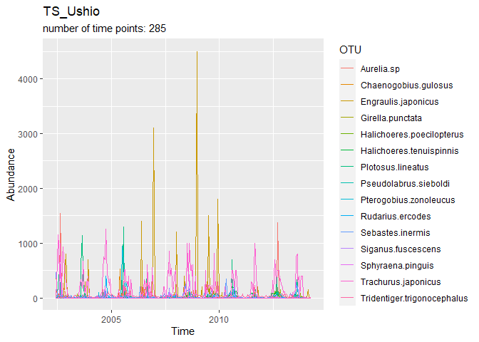

01f-timeseries-NODEBNGMpaper
================
Compiled at 2023-09-13 21:03:13 UTC

``` r
here::i_am(paste0(params$name, ".Rmd"), uuid = "9506fa44-f8a3-401c-aa4c-950659e05f3f")
```

The purpose of this document is …

``` r
library("conflicted")
library(data.table)
library(tidyverse)
library(phyloseq)
```

``` r
# create or *empty* the target directory, used to write this file's data: 
projthis::proj_create_dir_target(params$name, clean = TRUE)

# function to get path to target directory: path_target("sample.csv")
path_target <- projthis::proj_path_target(params$name)

# function to get path to previous data: path_source("00-import", "sample.csv")
path_source <- projthis::proj_path_source(params$name)
```

## Read Data

``` r
folderpath_data <-
  "C:/Users/Maria/Documents/Masterstudium/Masterarbeit/Literatur/Code/NODEBNGM/data/"

files <- c("TS_3DLV",
           "TS_AFR1",
           "TS_AFR2",
           "TS_AFR3",
           "TS_HL",
           "TS_RPS")

for(ts_name in files) {
  tmp <-
    fread(paste0(folderpath_data, ts_name, ".csv"), header = T)
  
  assign(paste0("dt_", ts_name),
         tmp)
}

# # convert to phyloseq after reading the data
# for(ts_name in files) {
#   tmp <-
#     as.matrix(fread(paste0(folderpath_data, ts_name, ".csv"),
#                     header = T), rownames = 1) %>%
#     t() %>% 
#     otu_table(taxa_are_rows = T)
#   
#   assign(paste0("ps_", ts_name),
#          phyloseq(tmp))
# }
rm(tmp)
```

``` r
# special case (including more sample info): TS_Ushio
dt_TS_Ushio_raw <- 
  fread(paste0(folderpath_data, "TS_Ushio.csv")) %>% 
  tibble::column_to_rownames("time_step")

dt_TS_Ushio <-
  dt_TS_Ushio_raw %>% select(
    "Aurelia.sp",
    "Engraulis.japonicus",
    "Plotosus.lineatus",
    "Sebastes.inermis",
    "Trachurus.japonicus",
    "Girella.punctata",
    "Pseudolabrus.sieboldi",
    "Halichoeres.poecilopterus",
    "Halichoeres.tenuispinnis",
    "Chaenogobius.gulosus",
    "Pterogobius.zonoleucus",
    "Tridentiger.trigonocephalus",
    "Siganus.fuscescens",
    "Sphyraena.pinguis",
    "Rudarius.ercodes"
  )

otu_TS_Ushio <-
  copy(dt_TS_Ushio) %>% 
  t() %>% 
  otu_table(taxa_are_rows = T)

samples_TS_Ushio <-
  dt_TS_Ushio_raw %>%
  select("date_tag", "surf.t", "bot.t", "Y", "M", "D")

ps_TS_Ushio <-
  phyloseq(otu_TS_Ushio, sample_data(samples_TS_Ushio))
```

``` r
# ps_TS_3DLV
# ps_TS_AFR1
# ps_TS_AFR2
# ps_TS_AFR3
# ps_TS_HL
# ps_TS_RPS

ps_TS_Ushio
```

    ## phyloseq-class experiment-level object
    ## otu_table()   OTU Table:         [ 15 taxa and 285 samples ]
    ## sample_data() Sample Data:       [ 285 samples by 6 sample variables ]

## Plot Datasets

``` r
for(ts_name in files) {
  tmp <-
    melt(get(paste0("dt_", ts_name)),
         id.vars = 1, variable.name = "Taxon", value.name = "Abundance")
  plt_tmp <-
    ggplot(tmp, aes(x = get(colnames(tmp)[1]), y = Abundance, col = Taxon)) +
    geom_line() +
    labs(title = ts_name,
         subtitle = paste0("number of time points: ", uniqueN(tmp[,1])),
         x = "Time")
  print(plt_tmp)
}
```

<!-- --><!-- --><!-- --><!-- --><!-- --><!-- -->

``` r
# TS_Ushio
tmp <-
    melt(data.table(Time = as.numeric(rownames(dt_TS_Ushio)), dt_TS_Ushio),
         id.vars = 1, variable.name = "Taxon", value.name = "Abundance")
```

    ## Warning in melt.data.table(data.table(Time = as.numeric(rownames(dt_TS_Ushio)),
    ## : 'measure.vars' [Aurelia.sp, Engraulis.japonicus, Plotosus.lineatus,
    ## Sebastes.inermis, ...] are not all of the same type. By order of hierarchy, the
    ## molten data value column will be of type 'double'. All measure variables not of
    ## type 'double' will be coerced too. Check DETAILS in ?melt.data.table for more
    ## on coercion.

``` r
plt_tmp <-
  ggplot(tmp, aes(x = as.numeric(Time), y = Abundance, col = Taxon)) +
  geom_line() +
  labs(title = ts_name,
       subtitle = paste0("number of time points: ", uniqueN(tmp[,1])),
       x = "Time")
  
print(plt_tmp)
```

<!-- -->

``` r
# bar plot phyloseq objects
plot_bar(ps_TS_Ushio, x = "as.numeric(Sample)", fill = "OTU") # +
```

<!-- -->

``` r
  # geom_bar(aes(color = OTU, fill = OTU), stat = "identity", position = "stack")
```

## Files written

These files have been written to the target directory,
`data/01f-timeseries-NODEBNGMpaper`:

``` r
projthis::proj_dir_info(path_target())
```

    ## # A tibble: 0 × 4
    ## # ℹ 4 variables: path <fs::path>, type <fct>, size <fs::bytes>,
    ## #   modification_time <dttm>
