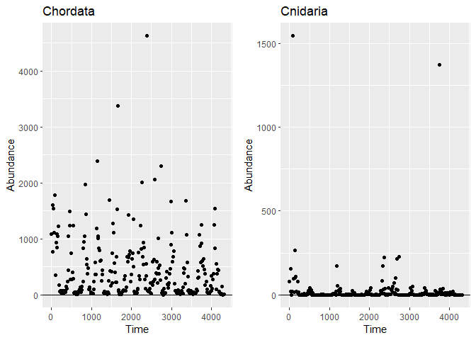
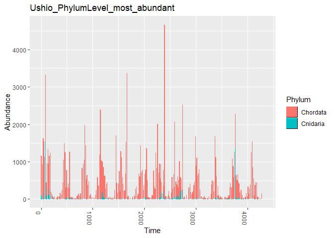
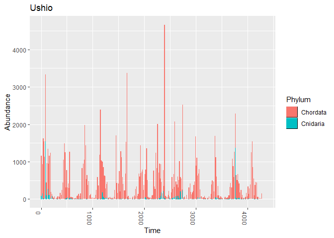

02 General Preprocessing (grouping and filtering) of the time series
================
Compiled at 2023-11-09 10:48:55 UTC

``` r
here::i_am(paste0(params$name, ".Rmd"), uuid = "b3a179f8-2944-4abb-be92-171ebdfd8e78")
```

Previously all time series have been converted into a uniform format as
a phyloseq object. This document now can be used for further processing
of the datasets. This includes conversion to relative counts, filtering
by the most abundant taxa and grouping by a certain taxonomic level.

``` r
library("conflicted")
library("tidyverse")
library("data.table")
library("phyloseq")
library("microViz") # for tax_fix
```

``` r
# create or *empty* the target directory, used to write this file's data: 
projthis::proj_create_dir_target(params$name, clean = TRUE)

# function to get path to target directory: path_target("sample.csv")
path_target <- projthis::proj_path_target(params$name)

# function to get path to previous data: path_source("00-import", "sample.csv")
path_source <- projthis::proj_path_source(params$name)
```

## Select name of object

``` r
# data_source <- "01a-timeseries-BioTIME"
# data_name_vec <- 
#   c("study_339", "study_363", "study_39", "study_478")
# data_name_vec <- 
#   paste0(data_name_vec, "_GenusLevel_most_abundant")

# data_source <- "01b-timeseries-CLVpaper"
# data_name_vec <- c("bucci_subject_1_rel_counts_most_abundant",
#                    "bucci_subject_2_rel_counts_most_abundant",
#                    "bucci_subject_3_rel_counts_most_abundant",
#                    "bucci_subject_4_rel_counts_most_abundant",
#                    "bucci_subject_5_rel_counts_most_abundant")

# data_source <- "01c-timeseries-miaTIME"
# data_name_vec <- c("Silverman_Vall_daily_rel_counts",
#                    "Silverman_Vall_hourly_rel_counts",
#                    "Silverman_Vall_all_rel_counts")
# data_name <- "Silverman_rel_counts"
# data_name <- "Silverman_V1_rel_counts"
# data_name <- "Silverman_V2_rel_counts"
# data_name <- "Silverman_V3_rel_counts"
# data_name <- "Silverman_V4_rel_counts"

# data_source <- "01d-timeseries-HumanGutData-Karwowska-paper"
# data_name_vec <- c("donorA_rel_counts", "donorB_rel_counts",
#                    "female_rel_counts", "male_rel_counts")
# data_name_vec <- c("male_rel_counts")

# data_source <- "01e-timeseries-miaSim"
# data_name <- "miaSim_GLV_4species_oscillating_zero"

data_source <- "01f-timeseries-NODEBNGMpaper"
# data_name_vec <- c("3DLV",  "AFR1", "AFR2", "AFR3", "HL", "RPS", "Ushio")
# data_name_vec <- c("RPS_rel_counts")
data_name_vec <- c("Ushio")
```

## Load phyloseq object

``` r
for(data_name in data_name_vec) {
  assign(paste0("ps_", data_name),
         readRDS(path_source(data_source,
                             paste0("ps_", data_name, ".rds"))))
}
```

## Group dataset by taxonomic rank

Aggregate the timeseries by summarizing counts over a taxonomic level.

``` r
tax_level = "Phylum"

for(data_name in data_name_vec) {
  
  tmp_ps <-
    get(paste0("ps_", data_name)) %>%
    tax_fix(sep = "_") %>%
    # summarize over tax level, include NAs
    tax_glom(taxrank = tax_level, NArm = FALSE)
  
  if(tax_level == "Phylum"){
    tmp_ps <- tmp_ps %>%
      speedyseq::transmute_tax_table(Kingdom, Phylum,
                                     .otu = Phylum)
  } else if (tax_level == "Class") {
    tmp_ps <- tmp_ps %>%
      speedyseq::transmute_tax_table(Kingdom, Phylum, Class,
                                     .otu = Class)
  } else if (tax_level == "Order") {
    tmp_ps <- tmp_ps %>%
      speedyseq::transmute_tax_table(Kingdom, Phylum, Class, Order,
                                     .otu = Order)
  } else if (tax_level == "Family") {
    tmp_ps <- tmp_ps %>%
      speedyseq::transmute_tax_table(Kingdom, Phylum, Class, Order, Family,
                                     .otu = Family)
  }else if (tax_level == "Genus") {
    tmp_ps <- tmp_ps %>%
      speedyseq::transmute_tax_table(Kingdom, Phylum, Class, Order, Family, Genus,
                                     .otu = get(tax_level))
  } else {
    tmp_ps <- tmp_ps %>%
      speedyseq::transmute_tax_table(Kingdom, Phylum, Class, Order,
                                     Family, Genus, Species,
                                     .otu = Species)
  }
  
  assign(paste0("ps_", data_name, "_", tax_level, "Level"),
         tmp_ps)
}

# update data names
data_name_vec_changed <-
  paste0(data_name_vec, "_", tax_level, "Level")
```

## Filter for most abundant taxa

``` r
# define thresholds to define most abundant taxa
zero = 1e-5
per_greater_zero = 0.20
th_mean = 1e-3
th_max = 0.01
```

Check for every taxon:

- if the max rel. count of all samples is at least 0.01 OR
- if mean rel. count over all samples is higher than 0.001 (in detail:
  samples with mean count \<= 0.001 are removed) AND
- if there are not more than 80% of the samples equal to zero (in
  detail: 20% of samples have a relative count \> 10^{-5})

``` r
for(data_name in data_name_vec_changed) {

  assign(
    paste0("ps_", data_name, "_most_abundant"),
    get(paste0("ps_", data_name)) %>%
      filter_taxa(function(x)
        (sum(x > zero) > (per_greater_zero * nsamples(.)) &
           mean(x) > th_mean) |
          max(x) > th_max,
        TRUE)
  )
}

# update data names
data_name_vec_changed <-
  paste0(data_name_vec_changed, "_most_abundant")
```

## Plot removed timeseries

``` r
dt_ps <- psmelt(get(paste0("ps_", data_name_vec_changed[1])))
otus <- dt_ps$OTU %>% unique()
#
# for(otu in otus){
#   # plot included taxa
#   plt_tmp <- ggplot(subset(dt_ps, OTU == otu),
#          aes(x = Time, y = Abundance)) +
#     geom_point() +
#     geom_hline(yintercept = 1e-5) +
#     labs(title = otu)
#   print(plt_tmp)
# }

dt_ps <- psmelt(get(paste0("ps_", data_name_vec[1]))) #, "_", tax_level, "Level")))
otus_not_included <-
  dt_ps$OTU[!dt_ps$OTU %in% otus] %>% unique()

plt_list = list()
for(otu in otus_not_included){
  # plot included taxa
  plt_tmp <- ggplot(subset(dt_ps, OTU == otu),
         aes(x = Time, y = Abundance)) +
    geom_point() +
    geom_hline(yintercept = 1e-5) +
    labs(title = otu)
  plt_list = c(plt_list, list(plt_tmp))
}
cowplot::plot_grid(plotlist=plt_list)
```

<!-- -->

``` r
dt_ps <- psmelt(get(paste0("ps_", data_name_vec_changed[1])))
otus <- dt_ps$OTU %>% unique()

plt_list = list()
for(otu in otus){
  # plot included taxa
  plt_tmp <- ggplot(subset(dt_ps, OTU == otu),
         aes(x = Time, y = Abundance)) +
    geom_point() +
    geom_hline(yintercept = 1e-5) +
    labs(title = otu)
  plt_list = c(plt_list, list(plt_tmp))
}
cowplot::plot_grid(plotlist=plt_list)
```

<!-- -->

## Plot final dataset

``` r
for(data_name in data_name_vec_changed) { 
  
  plt_tmp <- plot_bar(get(paste0("ps_", data_name)), x = "Time") +
    # theme(legend.position = "none") +
    labs(title = data_name,
         x = "Time",
         fill = tax_level) +
    geom_bar(aes(color = get(tax_level), fill = get(tax_level)),
             stat = "identity",
             position = "stack") +
    guides(color = "none")
  
  print(plt_tmp)
}
```

<!-- -->

``` r
# plot original datasets
for(data_name in data_name_vec) { 
  
  plt_tmp <- plot_bar(get(paste0("ps_", data_name)),
           x = "Time") +
    # theme(legend.position = "none") +
    labs(title = data_name,
         x = "Time",
         fill = tax_level) +
    geom_bar(aes(color = get(tax_level), fill = get(tax_level)),
             stat = "identity",
             position = "stack") +
    guides(color = "none")
  
  print(plt_tmp)
}
```

<!-- -->

## Save as csv file

``` r
for(data_name in data_name_vec_changed) { 
  
  # get the tmp phyloseq object
  ps_obj <- get(paste0("ps_", data_name))
  
  if(taxa_are_rows(ps_obj)) {
    otu_tmp <- t(otu_table(ps_obj))
  } else {
    otu_tmp <- otu_table(ps_obj)
  }
  # combine count data with time information
  ts_obj <-
    cbind(sample_data(ps_obj)[, "Time"],
          otu_tmp)
  # print(head(ts_obj))
  
  # save time series as csv file
  write.csv(
    ts_obj,
    path_target(paste0("ts_", data_name, ".csv")),
    row.names = F
  )
    
}
```

## Files written

These files have been written to the target directory,
`data/02-filter_and_group_ts`:

``` r
projthis::proj_dir_info(path_target())
```

    ## # A tibble: 1 × 4
    ##   path                                   type         size modification_time  
    ##   <fs::path>                             <fct> <fs::bytes> <dttm>             
    ## 1 ts_Ushio_PhylumLevel_most_abundant.csv file        4.74K 2023-11-09 10:49:06
